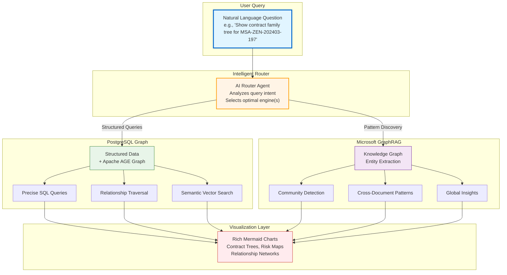
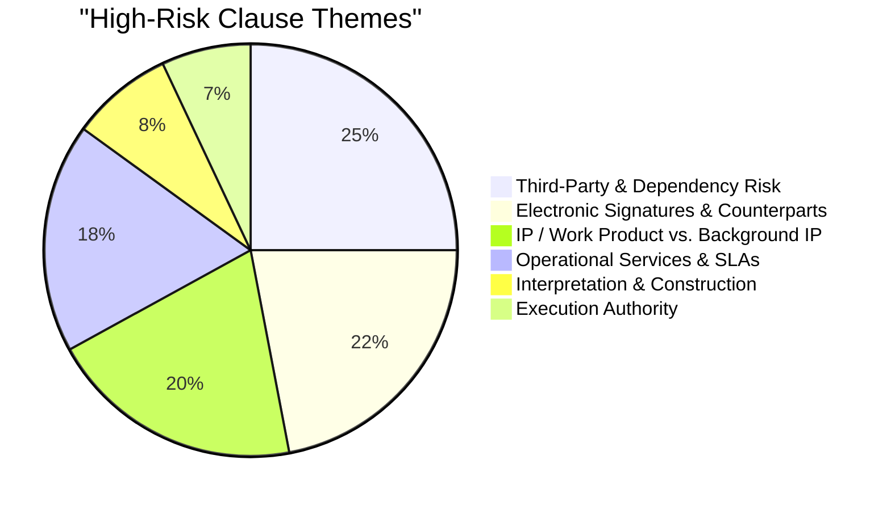
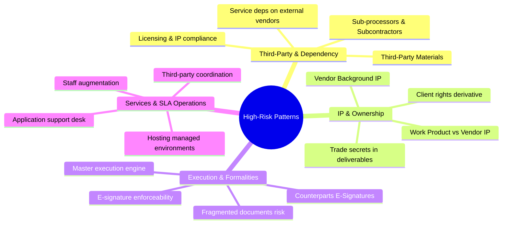
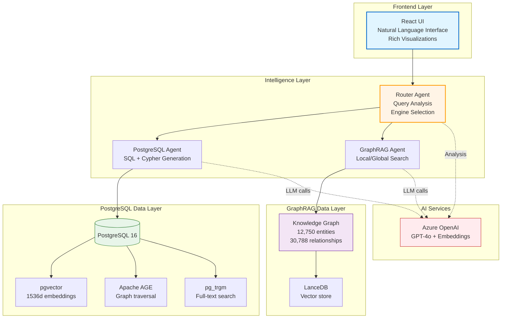
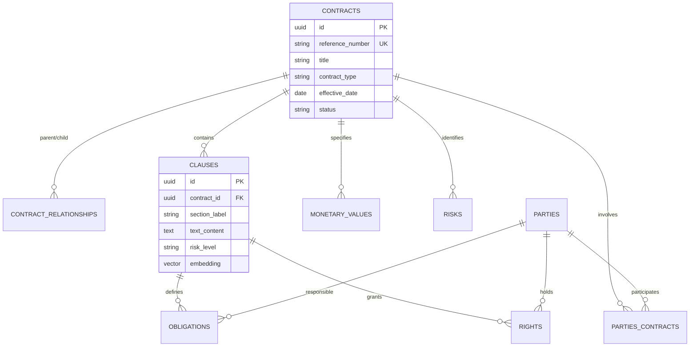

# 🏢 Contract Intelligence Platform

> **Enterprise-grade AI-powered contract analysis with dual graph engines for deep insights across your entire contract portfolio**

Transform mountains of legal documents into actionable intelligence. Unlike traditional RAG systems that treat each document in isolation, this platform understands the **complex relationships** between contracts, parties, obligations, and risks across your entire legal corpus.

---

## 🎯 The Business Case

### The Problem with Traditional Approaches

Most contract analysis tools fall into these categories:

**❌ Simple Document Q&A (Flat RAG)**
- Treats each contract independently
- No understanding of hierarchies (MSA → SOWs → Amendments)
- Cannot answer "Who are we exposed to across all vendor relationships?"
- Misses patterns across contract families

**❌ Basic Database Queries**
- Requires knowing exact field names and SQL
- No semantic understanding ("find liability caps" vs "WHERE clause_type = 'Limitation of Liability'")
- Cannot discover cross-document patterns
- Limited to structured fields only

### ✅ Our Solution: Dual-Graph Hybrid Intelligence

This platform combines **two complementary graph approaches** to deliver comprehensive contract intelligence:



---

## 🚀 Key Differentiators

### 1️⃣ PostgreSQL Graph: Precision & Structure

**When to use:** Specific queries about known contracts, parties, obligations, financial terms

**Capabilities:**
- 📋 **Contract Hierarchies**: MSAs → SOWs → Amendments → Work Orders with full lineage tracking
- 🔗 **Apache AGE Graph**: Multi-hop relationship traversal (Party → Contract → Clause → Obligation)
- 🔍 **Semantic Search**: pgvector embeddings (1536d) for conceptual clause matching
- 💰 **Financial Analytics**: Aggregate spend, payment terms, currency analysis
- ⚖️ **Risk Tracking**: High/medium/low risk clauses with rationale

**Example Query:**
```
"Show the complete contract family tree for Zenith Technologies MSA-ZEN-202403-197"
```

**AI-Generated Visualization:**

```mermaid
graph TD
    MSA["MSA-ZEN-202403-197<br/>Master Services Agreement<br/>📋 active"]
    
    SOW1["SOW-ZEN-202403-200<br/>Statement of Work<br/>📄 active"]
    SOW2["SOW-ZEN-202403-355<br/>Statement of Work<br/>📄 active"]
    WO1["WO-ZEN-202403-203<br/>Work Order<br/>📌 active"]
    WO2["WO-ZEN-202403-243<br/>Work Order<br/>📌 active"]
    AMD1["AMD-ZEN-202403-201<br/>Amendment to MSA<br/>📝 active"]
    
    ADD1["ADD-ZEN-202403-205<br/>Addendum to SOW<br/>📝 active"]
    ADD2["ADD-ZEN-202403-244<br/>Addendum to SOW<br/>📝 active"]
    ADD3["ADD-ZEN-202403-261<br/>Addendum to SOW<br/>📝 active"]
    AMD2["AMD-ZEN-202403-220<br/>Amendment to SOW<br/>📝 active"]
    
    WO3["WO-ZEN-202403-403<br/>Work Order under SOW 355<br/>📌 active"]
    
    MSA --> SOW1
    MSA --> SOW2
    MSA --> WO1
    MSA --> WO2
    MSA --> AMD1
    
    SOW1 --> ADD1
    SOW1 --> ADD2
    SOW1 --> ADD3
    SOW1 --> AMD2
    
    SOW2 --> WO3
    
    style MSA fill:#e1f5ff,stroke:#0066cc,stroke-width:3px
    style SOW1 fill:#fff4e6,stroke:#ff9800
    style SOW2 fill:#fff4e6,stroke:#ff9800
    style WO1 fill:#e8f5e9,stroke:#4caf50
    style WO2 fill:#e8f5e9,stroke:#4caf50
    style WO3 fill:#e8f5e9,stroke:#4caf50
    style AMD1 fill:#f3e5f5,stroke:#9c27b0
    style ADD1 fill:#f3e5f5,stroke:#9c27b0
    style ADD2 fill:#f3e5f5,stroke:#9c27b0
    style ADD3 fill:#f3e5f5,stroke:#9c27b0
    style AMD2 fill:#f3e5f5,stroke:#9c27b0
```



**Insight:** See the full contract lineage at a glance - 1 MSA spawns 2 SOWs, 3 Work Orders, 1 amendment, and 4 addendums

---

### 2️⃣ Microsoft GraphRAG: Pattern Discovery & Global Insights

**When to use:** Strategic questions, pattern analysis, risk assessments across all contracts

**Capabilities:**
- 🌐 **Global Search**: Corpus-wide pattern detection across 12,750+ entities
- 🏘️ **Community Detection**: Groups related clauses, parties, and themes
- 📊 **Trend Analysis**: "What are common themes in high-risk clauses?"
- 🔄 **Cross-Contract Intelligence**: Relationships not explicit in any single document
- 📈 **Strategic Insights**: Industry practice, vendor comparison, risk exposure

**Example Query:**
```
"What are the most common themes and patterns in our high-risk clauses across all contracts?"
```

**AI-Generated Analysis:**





**Insight:** Two meta-patterns emerge: (1) Heavy reliance on third parties + electronic execution, (2) Fine-grained IP carve-outs tightly wired into service structures

---

## 🎨 Rich Visual Intelligence

Every query generates **context-appropriate visualizations** automatically generated by AI:

### Contract Hierarchies
Visual family trees showing parent-child relationships

### Risk Distributions
Pie charts and bar graphs showing risk levels across portfolio

### Party Networks
Relationship graphs between clients, vendors, and subcontractors

### Financial Analytics
Charts showing contract values, payment terms, and spending patterns

---

## 💼 Enterprise Use Cases

### Legal & Compliance Teams

**🔍 Contract Discovery**
- "Find all contracts with auto-renewal clauses and notice periods"
- "Which contracts expire in Q2 2025?"
- "Show all amendments to our Data Processing Agreements"

**⚖️ Risk Assessment**
- "What are our highest risk liability clauses?"
- "Which contracts have uncapped liability?"
- "Compare indemnification terms across all vendor agreements"

### Finance & Procurement

**💰 Financial Analysis**
- "Total contract value by vendor"
- "What are our payment terms with Acme Corp?"
- "Which contracts have penalty clauses and what are the amounts?"

**📊 Portfolio Management**
- "How many active SOWs do we have under each MSA?"
- "Show contract family tree for our largest vendor relationship"

### Strategic Analysis

**🎯 Pattern Discovery**
- "What are common themes in our high-risk clauses across all contracts?"
- "How do our IP terms compare to industry standards?"
- "Which vendors have similar service level obligations?"

**🔄 Relationship Mapping**
- "Show all parties connected to high-risk obligations"
- "Map the vendor subcontractor relationships"
- "Which contracts share similar confidentiality terms?"

---

## 🏗️ Architecture Overview



---

## 🚀 Quick Start

### Prerequisites

1. **Azure PostgreSQL Flexible Server** with extensions:
   ```sql
   CREATE EXTENSION vector;        -- pgvector for semantic search
   CREATE EXTENSION age;           -- Apache AGE for graph queries
   CREATE EXTENSION pg_trgm;       -- Full-text search
   ```

2. **Azure OpenAI** deployments:
   - `gpt-4o` or `gpt-4` (reasoning)
   - `text-embedding-3-small` (embeddings)

3. **Python 3.11+** and **Node.js 20+**

### Installation

1. **Clone and configure:**
   ```bash
   git clone <repository>
   cd contract_intelligence
   cp .env.example .env
   # Edit .env with your Azure credentials
   ```

2. **Install dependencies:**
   ```bash
   # Backend
   pip install -r backend/requirements.txt
   
   # Frontend
   cd frontend
   npm install
   ```

3. **Use pre-generated sample data:**
   
   Sample contract data is already provided in `data/input/` (700+ contracts). If you want to regenerate it:
   ```bash
   # Note: This is a long-running operation (can take hours)
   python scripts/generate_seed_data.py
   ```

4. **Ingest data into PostgreSQL:**
   
   GraphRAG data is pre-ingested in `data/output/`. You only need to ingest into PostgreSQL:
   ```bash
   python data_ingestion/postgres_ingestion.py
   ```
   
   Or to re-run full dual ingestion pipeline:
   ```bash
   python data_ingestion/ingestion_pipeline.py
   ```

### Run the Application

**Backend (Terminal 1):**
```bash
start_backend.bat  # or: uvicorn backend.app.main:app --reload
```

**Frontend (Terminal 2):**
```bash
cd frontend
npm run dev
```

**Open:** http://localhost:5173

---

## 📊 Database Schema



---

## 🔧 Technology Stack

| Layer | Technology | Purpose |
|-------|-----------|---------|
| **Frontend** | React + TypeScript | Modern UI |
| **Visualization** | Mermaid.js | Auto-generated charts |
| **Backend** | FastAPI + Python | Async API |
| **AI Agents** | Microsoft Agent Framework | Orchestration |
| **Database** | PostgreSQL 16 | Structured data |
| **Vector Search** | pgvector | Semantic matching |
| **Graph Queries** | Apache AGE | Relationship traversal |
| **Knowledge Graph** | Microsoft GraphRAG | Pattern discovery |
| **LLM** | Azure OpenAI GPT-4o | Natural language |
| **Embeddings** | text-embedding-3-small | Vectors |
| **Deployment** | Azure Container Apps | Hosting |

---

## 📁 Project Structure

```
contract_intelligence/
├── backend/
│   ├── agents/              # PostgreSQL, GraphRAG, Router agents
│   ├── app/                 # FastAPI application
│   └── utils/               # Mermaid corrector, helpers
├── frontend/
│   └── src/
│       └── components/      # Query interface, results
├── data_ingestion/          # Dual ingestion pipeline
├── data/
│   ├── input/              # Raw contract markdown
│   └── output/             # GraphRAG artifacts
├── graphrag_config/        # GraphRAG settings
├── scripts/                # Deployment, seed data
└── Dockerfile              # Multi-stage build
```

---

## 🎓 Sample Queries

### PostgreSQL Graph Engine

**Contract Hierarchies:**
```
Show the complete contract family tree for MSA-ZEN-202403-197
List all SOWs under the Phoenix Industries Master Agreement
Find all amendments to Data Processing Agreement DPA-SUM-202502-324
```

**Party & Obligations:**
```
What obligations does Acme Corp have?
Show all high-risk obligations for Phoenix Industries
```

**Financial Analysis:**
```
What are the payment terms with Atlas Ventures?
List all contracts with values over $1M
```

**Semantic Search:**
```
Find clauses about data breach notification
Show limitation of liability clauses similar to Acme Corp
```

### Microsoft GraphRAG Engine

**Pattern Discovery:**
```
What are the most common themes in high-risk clauses?
How do termination clauses vary across vendor types?
```

**Strategic Insights:**
```
Compare our indemnification terms to industry best practices
Identify common vendor subcontractor patterns
```

---

## 🚢 Deployment

### Azure Container Apps

```bash
.\scripts\deploy-containerapp.ps1 -ImageTag latest --UseLocalDockerBuild
```

### Local Development

```bash
# Backend
start_backend.bat

# Frontend
cd frontend
npm run dev
```

---

## 🎯 Why This Matters

**Traditional systems require:**
- ❌ Manual review (slow, error-prone)
- ❌ SQL expertise (technical users only)
- ❌ Separate tools (fragmented insights)
- ❌ No cross-document understanding

**This platform delivers:**
- ✅ Natural language queries
- ✅ Automatic relationship discovery
- ✅ Visual intelligence
- ✅ Dual-engine approach
- ✅ Enterprise-ready

**The result:** Legal teams get answers in seconds, finance sees patterns instantly, executives gain strategic insights.

---

**Built with 💙**
