# 🧭 Building a Structured Agentic Graph RAG System

> **A conceptual walkthrough for architects and engineers** — from "why graphs?" to a production-ready dual-engine intelligence platform

This document walks through the **key concepts, architecture decisions, and implementation patterns** behind building a rich, structured, agentic Graph RAG system. It's designed as a presentation companion — read it before diving into any specific implementation.

---

## 📖 Table of Contents

1. [Why Plain RAG Falls Short](#1-why-plain-rag-falls-short)
2. [The Graph RAG Thesis](#2-the-graph-rag-thesis)
3. [Choosing Your Graph Strategy](#3-choosing-your-graph-strategy)
4. [Architecture: The Dual-Engine Pattern](#4-architecture-the-dual-engine-pattern)
5. [Data Ingestion: From Documents to Graphs](#5-data-ingestion-from-documents-to-graphs)
6. [The Structured Knowledge Graph](#6-the-structured-knowledge-graph)
7. [The Statistical Knowledge Graph (GraphRAG)](#7-the-statistical-knowledge-graph-graphrag)
8. [Agentic Query Routing](#8-agentic-query-routing)
9. [Vector Search in a Graph World](#9-vector-search-in-a-graph-world)
10. [Key Challenges & Lessons Learned](#10-key-challenges--lessons-learned)
11. [Production Considerations](#11-production-considerations)

---

## 1. Why Plain RAG Falls Short

Traditional Retrieval-Augmented Generation (RAG) works well for simple Q&A over documents. But it breaks down when your domain has **structure, relationships, and cross-document dependencies**.

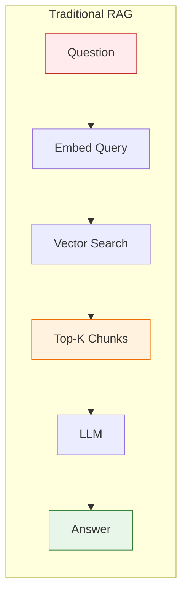

### What traditional RAG misses

| Limitation | Example |
|---|---|
| **No relationship awareness** | "Which vendors share subcontractors?" — requires traversing connections |
| **No hierarchy understanding** | An Amendment modifies a SOW which is under an MSA — flat chunks lose this |
| **No aggregation** | "Total spend across all active contracts" — can't SUM over chunks |
| **No cross-document patterns** | "Common themes in high-risk clauses" — requires corpus-wide analysis |
| **Hallucination on structure** | LLM invents data when chunks lack precise numbers or dates |

### The core insight

> **Documents contain both _content_ and _structure_. Traditional RAG captures content but discards structure. Graph RAG preserves both.**

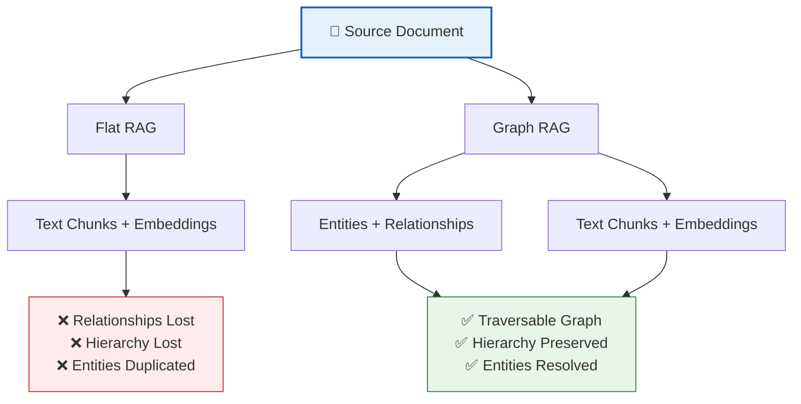

---

## 2. The Graph RAG Thesis

Graph RAG combines the **semantic power of embeddings** with the **structural power of graphs**. There are two complementary approaches:

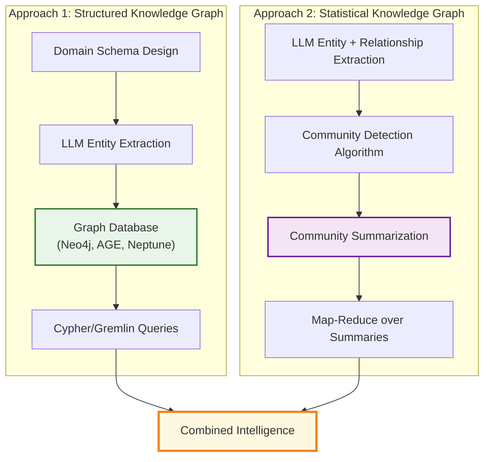

### When to use which

| Question Type | Best Approach | Why |
|---|---|---|
| "What are the payment terms for Vendor X?" | Structured Graph | Precise traversal through known schema |
| "Show the contract family tree for MSA-123" | Structured Graph | Hierarchy is explicit in edges |
| "What are common themes in high-risk clauses?" | Statistical Graph (GraphRAG) | Requires corpus-wide pattern detection |
| "How do IP terms vary across industries?" | Statistical Graph (GraphRAG) | Cross-document thematic analysis |
| "Find clauses about data breach notification" | Vector Search | Semantic similarity matching |
| "Total contract value by vendor" | Structured Graph + SQL | Aggregation over structured data |

---

## 3. Choosing Your Graph Strategy

Not every project needs both approaches. Here's a decision framework:

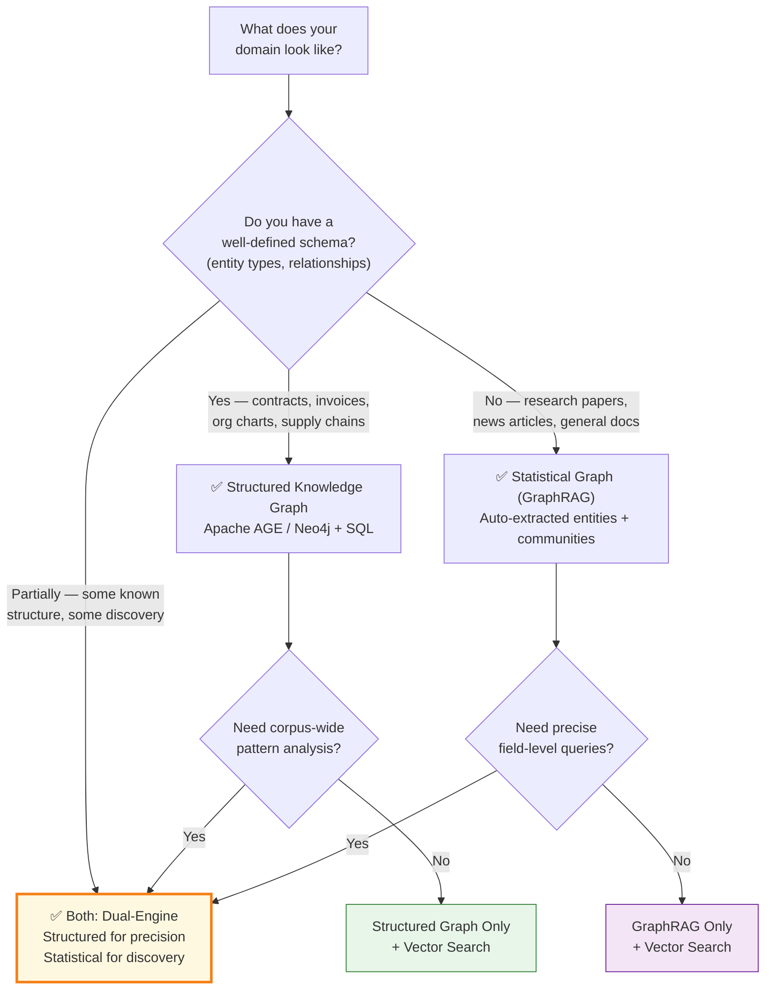

### The dual-engine sweet spot

Domains with **rich internal structure AND need for cross-document discovery** benefit most from both engines:

- **Legal contracts** — structured hierarchies + thematic risk patterns
- **Healthcare records** — coded diagnoses + treatment pattern discovery
- **Financial filings** — structured line items + industry trend analysis
- **Supply chain** — known vendor relationships + hidden dependency patterns

---

## 4. Architecture: The Dual-Engine Pattern

The architecture places an **AI router agent** in front of two specialized engines, each optimized for different query types:

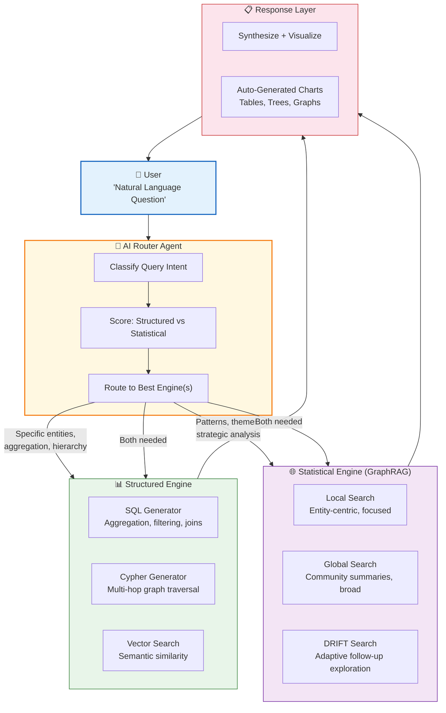

### Key design principles

1. **Single natural language interface** — Users never need to know which engine answers
2. **Router is an AI agent** — Not rule-based; it reasons about query intent
3. **Engines are independent** — Each can be deployed, scaled, and tested separately
4. **Shared data layer** — Both engines read from the same source of truth
5. **Response synthesis** — Results from either/both engines are unified before delivery

---

## 5. Data Ingestion: From Documents to Graphs

The ingestion pipeline is the most critical (and complex) part. It transforms unstructured documents into structured, queryable knowledge.

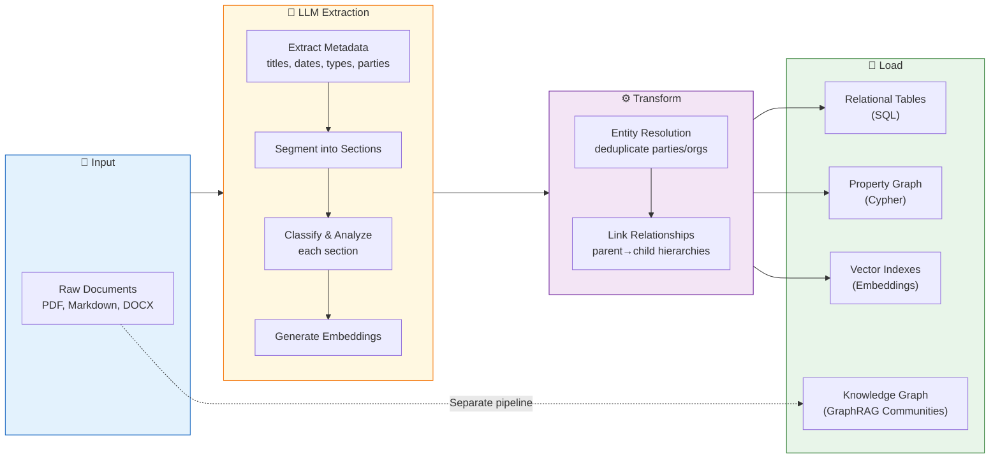

### The extraction challenge

LLM extraction is **the hardest step to get right**. Key considerations:

| Challenge | Approach |
|---|---|
| **Schema adherence** | Use structured outputs (JSON mode / Pydantic models) to enforce schema |
| **Consistency across documents** | Provide few-shot examples in prompts with exact field definitions |
| **Entity resolution** | Normalize names + fuzzy matching (e.g., "Acme Corp." = "Acme Corporation Inc.") |
| **Relationship inference** | Extract explicit references (parent contract IDs) + infer from context |
| **Scale** | Parallel processing with rate limiting; batch embedding calls |
| **Cost** | Segment documents first, then classify sections — avoids sending full docs to expensive models |

### Ingestion modes

A mature pipeline supports multiple modes for different operational needs:

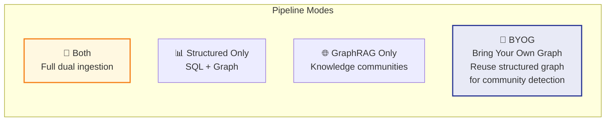

The **BYOG** (Bring Your Own Graph) mode is particularly interesting — it avoids duplicate LLM extraction costs by reusing the structured graph's entities and relationships as input to GraphRAG's community detection algorithm.

---

## 6. The Structured Knowledge Graph

This is the **precision engine** — a schema-driven property graph stored in a database that supports both SQL and Cypher queries.

### Schema design principles

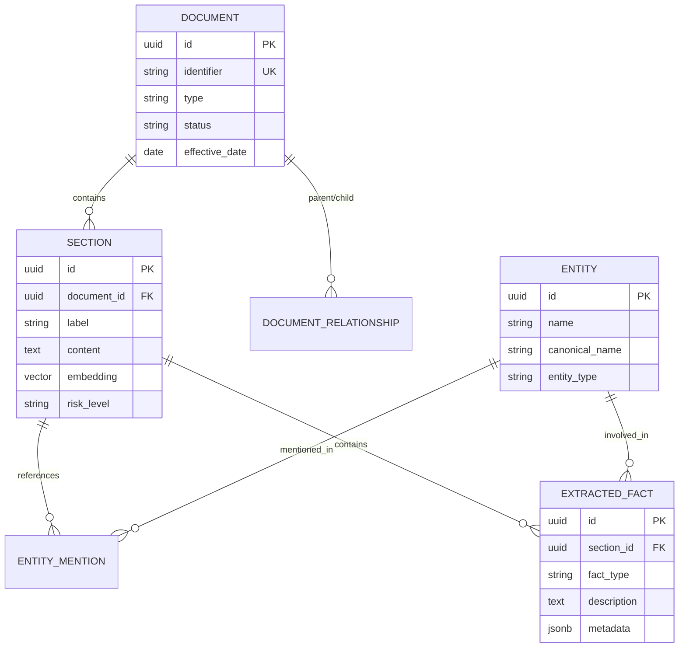

> **Design tip:** Keep your relational schema normalized but your graph schema denormalized. Graphs shine with **redundant properties on nodes** that avoid joins during traversal.

### Why a property graph on PostgreSQL?

Instead of a standalone graph database, using a **graph extension on your existing RDBMS** offers:

| Benefit | Detail |
|---|---|
| **Single infrastructure** | No separate Neo4j/Neptune cluster to manage |
| **SQL + Cypher in one** | Aggregation via SQL, traversal via Cypher, on the same data |
| **Shared vectors** | pgvector embeddings accessible from both SQL and graph queries |
| **ACID transactions** | Graph mutations are transactional with the rest of your data |
| **Familiar tooling** | Standard PostgreSQL monitoring, backup, connection pooling |

### Graph query patterns

The graph layer enables **multi-hop traversals** that would require complex recursive CTEs in pure SQL:

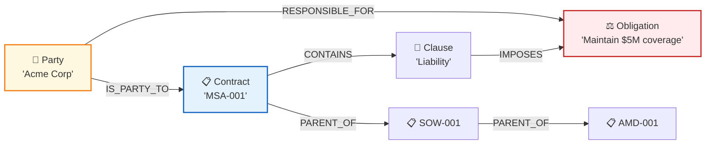

**Example traversals:**
- "All obligations for Party X across all contracts" → 3-hop traversal
- "Contract family tree for MSA-001" → recursive parent-child traversal
- "Parties sharing contracts with high-risk clauses" → pattern matching

---

## 7. The Statistical Knowledge Graph (GraphRAG)

Microsoft GraphRAG takes a fundamentally different approach. Instead of a pre-defined schema, it **auto-extracts entities and relationships**, then uses **community detection** to discover latent structure.

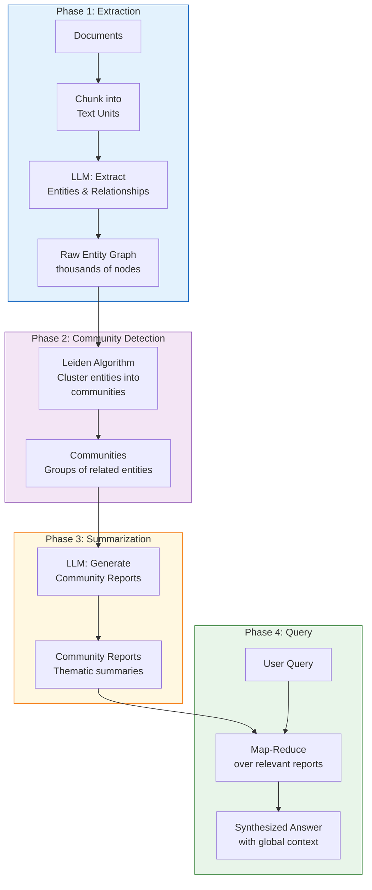

### How community detection works

The Leiden algorithm groups densely connected entities into communities — think of them as **"topics" that emerge from the data**:

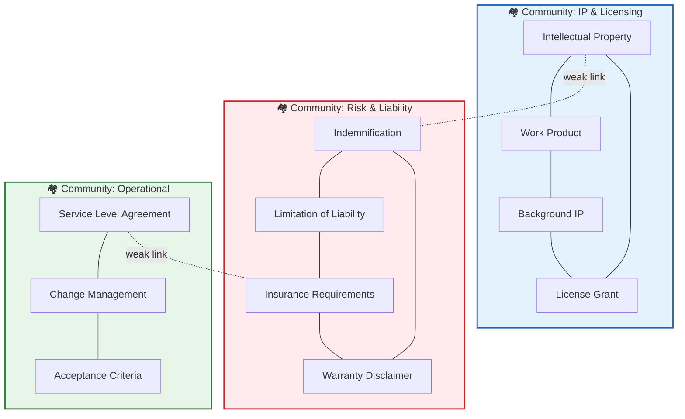

### Search modes

GraphRAG offers multiple search strategies:

| Mode | How It Works | Best For |
|---|---|---|
| **Local Search** | Find relevant entities → retrieve their community context | Focused questions about specific topics |
| **Global Search** | Map-Reduce across ALL community reports | Broad "what are the themes" questions |
| **DRIFT Search** | Iterative follow-up queries with adaptive depth | Exploratory analysis |
| **Basic Search** | Fast keyword-style retrieval with concurrency | High-throughput simple lookups |

---

## 8. Agentic Query Routing

The "agentic" in "Agentic Graph RAG" means the system **reasons about how to answer** rather than blindly searching:

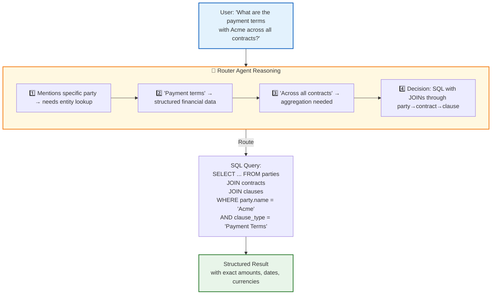

### Building a decision tree

Rather than vague instructions, give the agent a **precise numbered decision tree**:

```
STEP 1: Does the query ask about MEANING, THEMES, or PATTERNS
        across many documents?
   YES → Use GraphRAG (Global Search)
   NO  → Continue to Step 2

STEP 2: Does the query mention SPECIFIC entities by name
        or ask for SPECIFIC facts (dates, amounts, counts)?
   YES → Use Structured Engine (SQL or Cypher)
   NO  → Continue to Step 3

STEP 3: Does the query ask about RELATIONSHIPS or PATHS
        between entities (hierarchies, connections)?
   YES → Use Cypher (graph traversal)
   NO  → Continue to Step 4

STEP 4: Does the query use CONCEPTUAL language
        ("clauses like...", "similar to...")?
   YES → Use Vector Search (semantic similarity)
   NO  → Default to SQL
```

### Agent as a tool-calling LLM

The agent pattern uses the LLM as a **reasoning engine** that selects and orchestrates tools:

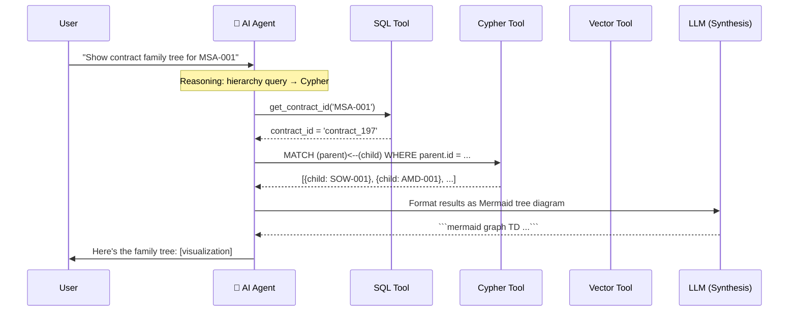

> **Key insight:** The agent may make **multiple tool calls** to answer one question. For example, looking up an identifier via SQL before using it in a Cypher query. This multi-step reasoning is what makes it "agentic."

---

## 9. Vector Search in a Graph World

Vector search and graph queries are **complementary, not competing**:

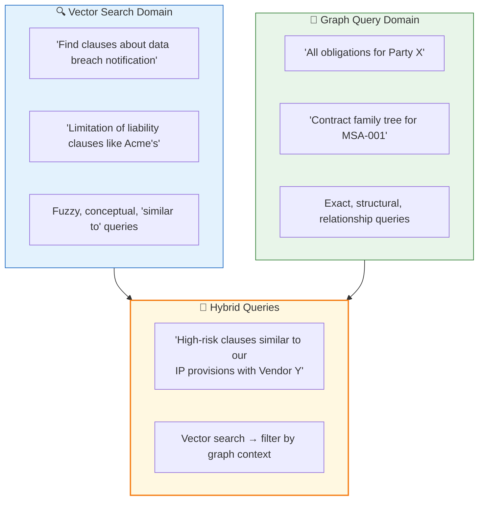

### Shared vector store pattern

A powerful pattern is storing vectors **in the same database** as your structured and graph data:

```
┌─────────────────────────────────────────────────┐
│              PostgreSQL                          │
│                                                  │
│  📊 Relational Tables    (SQL queries)           │
│  🔗 Property Graph       (Cypher queries)        │
│  🔍 Vector Indexes       (Similarity search)     │
│  🌐 GraphRAG Vectors     (Entity embeddings)     │
│                                                  │
│  → One database. One connection. Full power.     │
└─────────────────────────────────────────────────┘
```

**Benefits of co-located vectors:**
- Filter vector results by graph context (e.g., "similar clauses, but only in active contracts")
- Enrich vector results with structured metadata without additional queries
- Single infrastructure to deploy, monitor, and back up

---

## 10. Key Challenges & Lessons Learned

### Challenge 1: Entity Resolution

The same entity appears differently across documents:

```
"Acme Corporation, Inc."  →  canonical: "acme corporation"
"ACME CORP."              →  canonical: "acme"  (fuzzy match → same entity)
"Acme Corp"               →  canonical: "acme"  (fuzzy match → same entity)
```

**Solution:** Two-layer resolution:
1. **Normalization** — strip legal suffixes, lowercase, remove punctuation
2. **Fuzzy matching** — trigram similarity (pg_trgm) with threshold ≥ 0.8

### Challenge 2: Graph Schema vs. SQL Schema Mismatch

Property names differ between SQL tables and graph nodes:

| Concept | SQL Column | Graph Property |
|---|---|---|
| Contract ID | `contract_identifier` | `identifier` |
| Contract type | `contract_type` | `type` |
| Clause section | `section_label` | `section` |

**Solution:** Document the mapping explicitly and teach the AI agent about it in the system prompt.

### Challenge 3: LLM Extraction Consistency

LLMs extract slightly different structures from similar documents.

**Solutions:**
- Use **structured outputs** (JSON schema / Pydantic models) to enforce format
- Provide **domain-specific extraction prompts** with examples
- **Post-validate** extracted data against the schema before insertion
- Run extraction in **parallel with rate limiting** for throughput

### Challenge 4: Custom Prompt Maintenance

When using frameworks like GraphRAG, default prompts are generic. Domain-specific prompts dramatically improve quality but **must be maintained across version upgrades**.

> **Lesson:** Custom prompts are living documents. Track them in version control and test them with each framework upgrade.

### Challenge 5: Graph Query Generation

LLMs sometimes generate invalid Cypher queries. Common mistakes:

| Mistake | Fix |
|---|---|
| Wrong property names | Include property mapping in the system prompt |
| Unsupported operators | List supported operators explicitly |
| Missing graph path setup | Include boilerplate in prompt templates |
| Over-complex queries | Teach the agent to decompose into multiple simpler queries |

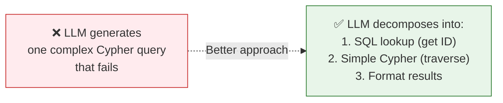

---

## 11. Production Considerations

### Infrastructure

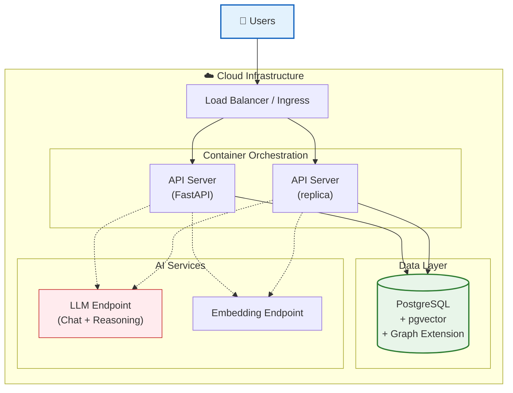

### Cost optimization

| Strategy | Impact |
|---|---|
| **Cache LLM responses** | Avoid re-extracting identical documents |
| **Batch embedding calls** | Reduce API round-trips |
| **BYOG mode** | Reuse structured graph for GraphRAG — avoids duplicate extraction |
| **Tiered models** | Use smaller models for classification, larger for extraction |
| **Incremental ingestion** | Only process new/changed documents |

### Monitoring

Key metrics to track:

- **Query routing accuracy** — Is the router sending queries to the right engine?
- **Query latency by type** — SQL vs. Cypher vs. Vector vs. GraphRAG response times
- **LLM token usage** — Per-query and per-ingestion costs
- **Graph size growth** — Nodes and edges over time
- **Entity resolution hit rate** — How often fuzzy matching prevents duplicates

### Security

- **Never expose raw SQL/Cypher to users** — The AI agent generates queries, but users interact via natural language only
- **Parameterize queries** — Prevent injection through agent-generated queries
- **Row-level security** — Use PostgreSQL RLS policies for multi-tenant deployments
- **Secret management** — API keys in environment variables or secret stores, never in code

---

## Summary: The Pattern at a Glance

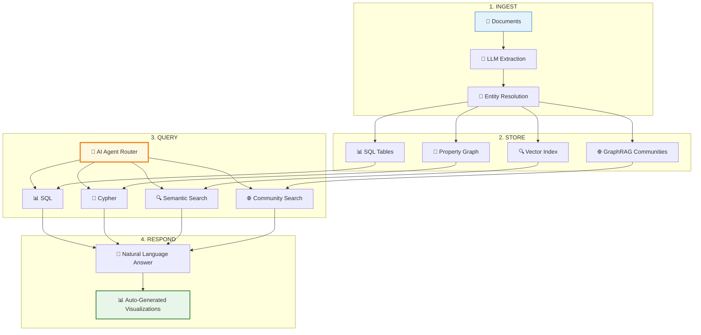

### Key takeaways

1. **Graphs preserve structure** that flat RAG discards — hierarchies, relationships, provenance
2. **Two graph approaches** serve different needs: structured (precision) vs. statistical (discovery)
3. **Agentic routing** lets a single natural language interface select the best query strategy
4. **Co-locate everything** in one database when possible — SQL, graph, vectors
5. **Entity resolution** is the unsung hero — without it, your graph is full of duplicates
6. **Custom prompts** for your domain make the difference between demo and production quality
7. **Start with the structured graph** — it delivers immediate value; add GraphRAG when you need corpus-wide pattern discovery

---

> **Next:** Explore the [Contract Intelligence Platform](contract_intelligence/README.md) to see these patterns implemented in a production system for legal contract analysis.
