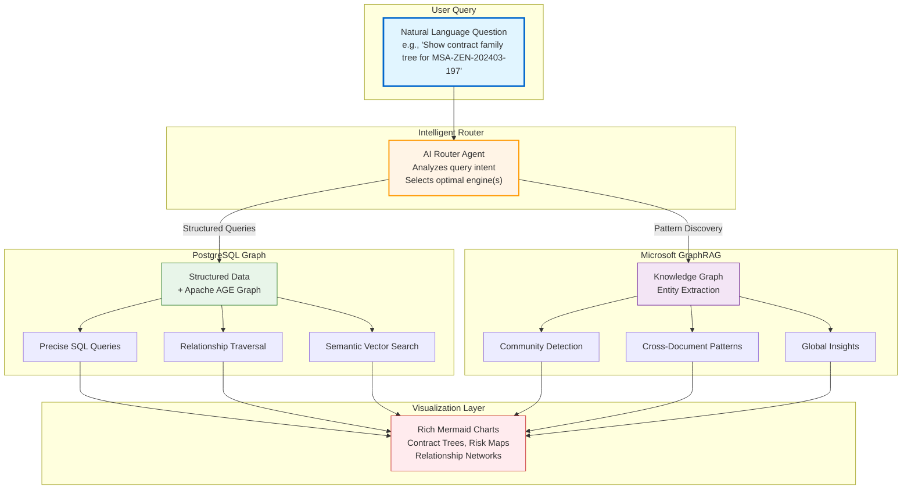
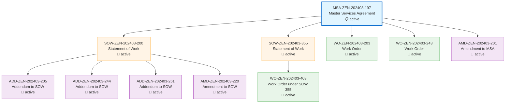
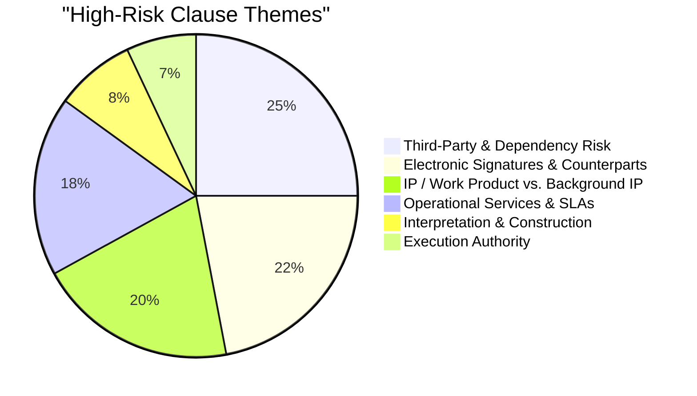
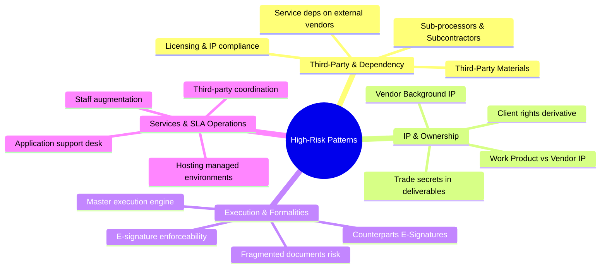
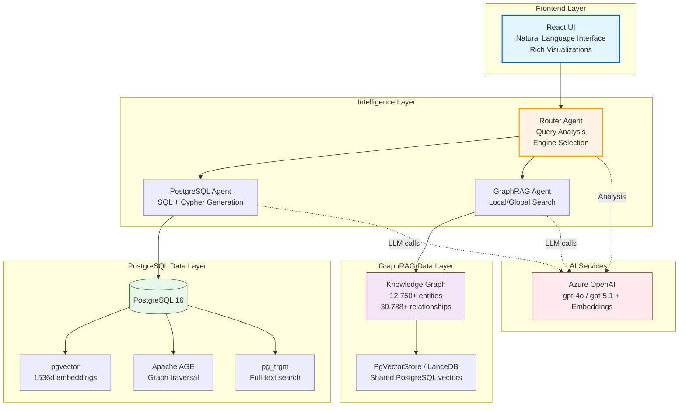
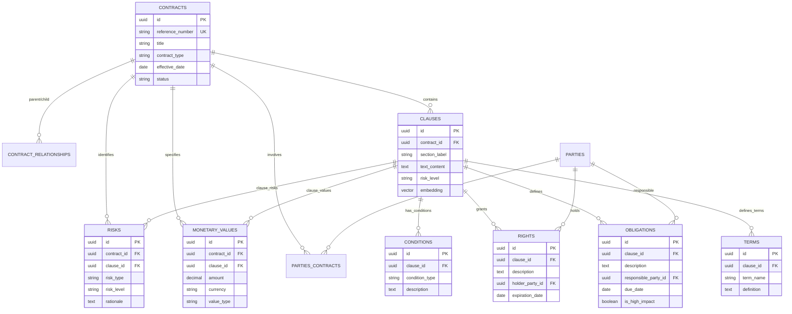
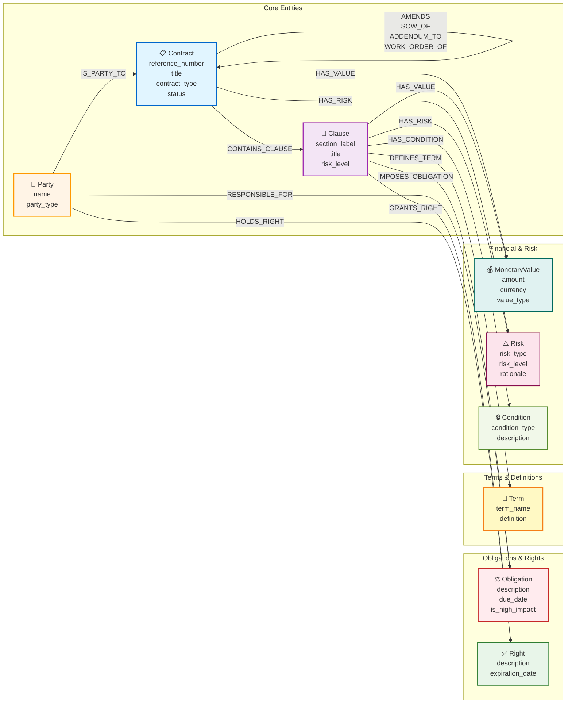

# 🏢 Contract Intelligence Platform

> **Enterprise-grade AI-powered contract analysis with dual graph engines for deep insights across your entire contract portfolio**

Transform mountains of legal documents into actionable intelligence. Unlike traditional RAG systems that treat each document in isolation, this platform understands the **complex relationships** between contracts, parties, obligations, and risks across your entire legal corpus.

---

## 🎯 The Business Case

### The Problem with Traditional Approaches

Most contract analysis tools fall into these categories:

**❌ Simple Document Q&A (Flat RAG)**
- Treats each contract independently
- No understanding of hierarchies (MSA → SOWs → Amendments)
- Cannot answer "Who are we exposed to across all vendor relationships?"
- Misses patterns across contract families

**❌ Basic Database Queries**
- Requires knowing exact field names and SQL
- No semantic understanding ("find liability caps" vs "WHERE clause_type = 'Limitation of Liability'")
- Cannot discover cross-document patterns
- Limited to structured fields only

### ✅ Our Solution: Dual-Graph Hybrid Intelligence

This platform combines **two complementary graph approaches** to deliver comprehensive contract intelligence:


```mermaid
graph TB
    subgraph "User Query"
        Q["Natural Language Question<br/>e.g., 'Show contract family tree for MSA-ZEN-202403-197'"]
    end
    
    subgraph "Intelligent Router"
        R["AI Router Agent<br/>Analyzes query intent<br/>Selects optimal engine(s)"]
    end
    
    subgraph "PostgreSQL Graph"
        P1["Structured Data<br/>+ Apache AGE Graph"]
        P2["Precise SQL Queries"]
        P3["Relationship Traversal"]
        P4["Semantic Vector Search"]
    end
    
    subgraph "Microsoft GraphRAG"
        G1["Knowledge Graph<br/>Entity Extraction"]
        G2["Community Detection"]
        G3["Cross-Document Patterns"]
        G4["Global Insights"]
    end
    
    subgraph "Visualization Layer"
        V["Rich Mermaid Charts<br/>Contract Trees, Risk Maps<br/>Relationship Networks"]
    end
    
    Q --> R
    R -->|Structured Queries| P1
    R -->|Pattern Discovery| G1
    P1 --> P2
    P1 --> P3
    P1 --> P4
    P2 --> V
    P3 --> V
    P4 --> V
    G1 --> G2
    G1 --> G3
    G1 --> G4
    G2 --> V
    G3 --> V
    G4 --> V
    
    style Q fill:#e1f5ff,stroke:#0066cc,stroke-width:3px
    style R fill:#fff4e6,stroke:#ff9800,stroke-width:2px
    style P1 fill:#e8f5e9,stroke:#2e7d32
    style G1 fill:#f3e5f5,stroke:#6a1b9a
    style V fill:#ffebee,stroke:#c62828
```

---

## 🚀 Key Differentiators

### 1️⃣ PostgreSQL Graph: Precision & Structure

**When to use:** Specific queries about known contracts, parties, obligations, financial terms

**Capabilities:**
- 📋 **Contract Hierarchies**: MSAs → SOWs → Amendments → Work Orders with full lineage tracking
- 🔗 **Apache AGE 1.6.0 Graph**: Multi-hop relationship traversal with Cypher, `=~` regex, `CONTAINS`
- 🔍 **Semantic Search**: pgvector embeddings (1536d) for conceptual clause matching
- 💰 **Financial Analytics**: Aggregate spend, payment terms, currency analysis
- ⚖️ **Risk Tracking**: High/medium/low risk clauses with rationale

**Example Query:**
```
"Show the complete contract family tree for Zenith Technologies MSA-ZEN-202403-197"
```

**AI-Generated Visualization:**


```mermaid
graph TD
    MSA["MSA-ZEN-202403-197<br/>Master Services Agreement<br/>📋 active"]
    
    SOW1["SOW-ZEN-202403-200<br/>Statement of Work<br/>📄 active"]
    SOW2["SOW-ZEN-202403-355<br/>Statement of Work<br/>📄 active"]
    WO1["WO-ZEN-202403-203<br/>Work Order<br/>📌 active"]
    WO2["WO-ZEN-202403-243<br/>Work Order<br/>📌 active"]
    AMD1["AMD-ZEN-202403-201<br/>Amendment to MSA<br/>📝 active"]
    
    ADD1["ADD-ZEN-202403-205<br/>Addendum to SOW<br/>📝 active"]
    ADD2["ADD-ZEN-202403-244<br/>Addendum to SOW<br/>📝 active"]
    ADD3["ADD-ZEN-202403-261<br/>Addendum to SOW<br/>📝 active"]
    AMD2["AMD-ZEN-202403-220<br/>Amendment to SOW<br/>📝 active"]
    
    WO3["WO-ZEN-202403-403<br/>Work Order under SOW 355<br/>📌 active"]
    
    MSA --> SOW1
    MSA --> SOW2
    MSA --> WO1
    MSA --> WO2
    MSA --> AMD1
    
    SOW1 --> ADD1
    SOW1 --> ADD2
    SOW1 --> ADD3
    SOW1 --> AMD2
    
    SOW2 --> WO3
    
    style MSA fill:#e1f5ff,stroke:#0066cc,stroke-width:3px
    style SOW1 fill:#fff4e6,stroke:#ff9800
    style SOW2 fill:#fff4e6,stroke:#ff9800
    style WO1 fill:#e8f5e9,stroke:#4caf50
    style WO2 fill:#e8f5e9,stroke:#4caf50
    style WO3 fill:#e8f5e9,stroke:#4caf50
    style AMD1 fill:#f3e5f5,stroke:#9c27b0
    style ADD1 fill:#f3e5f5,stroke:#9c27b0
    style ADD2 fill:#f3e5f5,stroke:#9c27b0
    style ADD3 fill:#f3e5f5,stroke:#9c27b0
    style AMD2 fill:#f3e5f5,stroke:#9c27b0
```

**Insight:** See the full contract lineage at a glance - 1 MSA spawns 2 SOWs, 3 Work Orders, 1 amendment, and 4 addendums

---

### 2️⃣ Microsoft GraphRAG: Pattern Discovery & Global Insights

**When to use:** Strategic questions, pattern analysis, risk assessments across all contracts

**Capabilities:**
- 🌐 **Global Search**: Corpus-wide pattern detection across 12,750+ entities
- 🏘️ **Community Detection**: Groups related clauses, parties, and themes
- 📊 **Trend Analysis**: "What are common themes in high-risk clauses?"
- 🔄 **Cross-Contract Intelligence**: Relationships not explicit in any single document
- 📈 **Strategic Insights**: Industry practice, vendor comparison, risk exposure
- 🧭 **DRIFT Search**: Follow-up exploration with adaptive depth (new in v3)
- 📋 **Basic Search**: Fast keyword-style retrieval with concurrency (new in v3)

**Example Query:**
```
"What are the most common themes and patterns in our high-risk clauses across all contracts?"
```

**AI-Generated Analysis:**


```mermaid
pie title "High-Risk Clause Themes"
    "Third-Party & Dependency Risk" : 25
    "Electronic Signatures & Counterparts" : 22
    "IP / Work Product vs. Background IP" : 20
    "Operational Services & SLAs" : 18
    "Interpretation & Construction" : 8
    "Execution Authority" : 7
```


```mermaid
mindmap
  root((High-Risk Patterns))
    Third-Party & Dependency
      Third-Party Materials
      Sub-processors & Subcontractors
      Service deps on external vendors
      Licensing & IP compliance
    IP & Ownership
      Work Product vs Vendor IP
      Vendor Background IP
      Trade secrets in deliverables
      Client rights derivative
    Execution & Formalities
      Counterparts E-Signatures
      Master execution engine
      E-signature enforceability
      Fragmented documents risk
    Services & SLA Operations
      Hosting managed environments
      Application support desk
      Staff augmentation
      Third-party coordination
```

**Insight:** Two meta-patterns emerge: (1) Heavy reliance on third parties + electronic execution, (2) Fine-grained IP carve-outs tightly wired into service structures

---

## 🎨 Rich Visual Intelligence

Every query generates **context-appropriate visualizations** automatically generated by AI:

### Contract Hierarchies
Visual family trees showing parent-child relationships

### Risk Distributions
Pie charts and bar graphs showing risk levels across portfolio

### Party Networks
Relationship graphs between clients, vendors, and subcontractors

### Financial Analytics
Charts showing contract values, payment terms, and spending patterns

---

## 💼 Enterprise Use Cases

### Legal & Compliance Teams

**🔍 Contract Discovery**
- "Find all contracts with auto-renewal clauses and notice periods"
- "Which contracts expire in Q2 2025?"
- "Show all amendments to our Data Processing Agreements"

**⚖️ Risk Assessment**
- "What are our highest risk liability clauses?"
- "Which contracts have uncapped liability?"
- "Compare indemnification terms across all vendor agreements"

### Finance & Procurement

**💰 Financial Analysis**
- "Total contract value by vendor"
- "What are our payment terms with Acme Corp?"
- "Which contracts have penalty clauses and what are the amounts?"

**📊 Portfolio Management**
- "How many active SOWs do we have under each MSA?"
- "Show contract family tree for our largest vendor relationship"

### Strategic Analysis

**🎯 Pattern Discovery**
- "What are common themes in our high-risk clauses across all contracts?"
- "How do our IP terms compare to industry standards?"
- "Which vendors have similar service level obligations?"

**🔄 Relationship Mapping**
- "Show all parties connected to high-risk obligations"
- "Map the vendor subcontractor relationships"
- "Which contracts share similar confidentiality terms?"

---

## 🏗️ Architecture Overview


```mermaid
graph TB
    subgraph "Frontend Layer"
        UI["React UI<br/>Natural Language Interface<br/>Rich Visualizations"]
    end
    
    subgraph "Intelligence Layer"
        Router["Router Agent<br/>Query Analysis<br/>Engine Selection"]
        PG_Agent["PostgreSQL Agent<br/>SQL + Cypher Generation"]
        GR_Agent["GraphRAG Agent<br/>Local/Global Search"]
    end
    
    subgraph "PostgreSQL Data Layer"
        PG_DB[("PostgreSQL 16")]
        PG_Vec["pgvector<br/>1536d embeddings"]
        PG_AGE["Apache AGE<br/>Graph traversal"]
        PG_FTS["pg_trgm<br/>Full-text search"]
    end
    
    subgraph "GraphRAG Data Layer"
        GR_Data["Knowledge Graph<br/>12,750+ entities<br/>30,788+ relationships"]
        GR_Vec["PgVectorStore / LanceDB<br/>Shared PostgreSQL vectors"]
    end
    
    subgraph "AI Services"
        Azure["Azure OpenAI<br/>gpt-4o / gpt-5.1 + Embeddings"]
    end
    
    UI --> Router
    Router --> PG_Agent
    Router --> GR_Agent
    
    PG_Agent --> PG_DB
    PG_DB --> PG_Vec
    PG_DB --> PG_AGE
    PG_DB --> PG_FTS
    
    GR_Agent --> GR_Data
    GR_Data --> GR_Vec
    
    PG_Agent -.->|LLM calls| Azure
    GR_Agent -.->|LLM calls| Azure
    Router -.->|Analysis| Azure
    
    style UI fill:#e1f5ff,stroke:#0066cc,stroke-width:2px
    style Router fill:#fff4e6,stroke:#ff9800,stroke-width:2px
    style PG_DB fill:#e8f5e9,stroke:#2e7d32
    style GR_Data fill:#f3e5f5,stroke:#6a1b9a
    style Azure fill:#ffebee,stroke:#c62828
```

---

## 🚀 Quick Start

### Prerequisites

1. **Azure PostgreSQL Flexible Server** with extensions:
   ```sql
   CREATE EXTENSION vector;        -- pgvector for semantic search
   CREATE EXTENSION age;           -- Apache AGE 1.6.0+ for Cypher graph queries
   CREATE EXTENSION pg_trgm;       -- Full-text search
   ```

2. **Azure OpenAI** deployments:
   - `gpt-4o` or `gpt-5.1` (reasoning / chat completion)
   - `text-embedding-3-small` (1536-dimension embeddings)

3. **Python 3.12+** and **Node.js 20+**

### Installation

1. **Clone and configure:**
   ```bash
   git clone <repository>
   cd contract_intelligence
   cp .env.example .env
   # Edit .env with your Azure credentials:
   #   AZURE_OPENAI_API_KEY, AZURE_OPENAI_ENDPOINT,
   #   AZURE_OPENAI_DEPLOYMENT_NAME, EMBEDDING_DEPLOYMENT_NAME,
   #   POSTGRES_HOST, POSTGRES_DATABASE, POSTGRES_USER, POSTGRES_ADMIN_PASSWORD
   ```

2. **Install dependencies:**
   ```bash
   # Backend (using uv for fast installs — recommended)
   pip install uv
   uv pip install --prerelease=allow -r backend/requirements.txt
   
   # Or with standard pip
   pip install --pre -r backend/requirements.txt
   
   # Frontend
   cd frontend
   npm install
   ```

3. **Use pre-generated sample data:**
   
   Sample contract data is already provided in `data/input/` (700+ contracts). If you want to regenerate it:
   ```bash
   # Note: This is a long-running operation (can take hours)
   python scripts/generate_seed_data.py
   ```

4. **Ingest data into PostgreSQL:**
   
   GraphRAG data is pre-ingested in `data/output/`. You only need to ingest into PostgreSQL:
   ```bash
   python data_ingestion/postgres_ingestion.py
   ```
   
   This will automatically:
   - Create the PostgreSQL schema with all tables
   - Extract and ingest contract data using LLM
   - Build the Apache AGE graph with nodes and relationships
   - Generate a data exploration report
   
   Or to re-run the full dual ingestion pipeline:
   ```bash
   # Default mode: both PostgreSQL and GraphRAG
   python data_ingestion/ingestion_pipeline.py
   
   # Specific modes:
   python data_ingestion/ingestion_pipeline.py --mode postgres   # PostgreSQL + AGE only
   python data_ingestion/ingestion_pipeline.py --mode graphrag   # GraphRAG indexing only
   python data_ingestion/ingestion_pipeline.py --mode both       # Run both (default)
   python data_ingestion/ingestion_pipeline.py --mode byog       # PostgreSQL first, then export graph for GraphRAG community summarization
   ```
   
   **Note:** The graph build step is integrated into the ingestion pipeline. If you need to rebuild only the Apache AGE graph (after data updates):
   ```bash
   python data_ingestion/build_graph.py
   ```

### Run the Application

**Backend (Terminal 1):**
```bash
start_backend.bat  # or: uvicorn backend.app.main:app --reload
```

**Frontend (Terminal 2):**
```bash
cd frontend
npm run dev
```

**Open:** http://localhost:5173

---

## 📊 Database Schema

### PostgreSQL Relational Schema


```mermaid
erDiagram
    CONTRACTS ||--o{ CONTRACT_RELATIONSHIPS : "parent/child"
    CONTRACTS ||--o{ CLAUSES : contains
    CONTRACTS ||--o{ PARTIES_CONTRACTS : involves
    CONTRACTS ||--o{ MONETARY_VALUES : specifies
    CONTRACTS ||--o{ RISKS : identifies
    
    CLAUSES ||--o{ OBLIGATIONS : defines
    CLAUSES ||--o{ RIGHTS : grants
    CLAUSES ||--o{ TERMS : defines_terms
    CLAUSES ||--o{ MONETARY_VALUES : clause_values
    CLAUSES ||--o{ RISKS : clause_risks
    CLAUSES ||--o{ CONDITIONS : has_conditions
    
    PARTIES ||--o{ PARTIES_CONTRACTS : participates
    PARTIES ||--o{ OBLIGATIONS : responsible
    PARTIES ||--o{ RIGHTS : holds
    
    CONTRACTS {
        uuid id PK
        string reference_number UK
        string title
        string contract_type
        date effective_date
        string status
    }
    
    CLAUSES {
        uuid id PK
        uuid contract_id FK
        string section_label
        text text_content
        string risk_level
        vector embedding
    }
    
    OBLIGATIONS {
        uuid id PK
        uuid clause_id FK
        text description
        uuid responsible_party_id FK
        date due_date
        boolean is_high_impact
    }
    
    RIGHTS {
        uuid id PK
        uuid clause_id FK
        text description
        uuid holder_party_id FK
        date expiration_date
    }
    
    TERMS {
        uuid id PK
        uuid clause_id FK
        string term_name
        text definition
    }
    
    MONETARY_VALUES {
        uuid id PK
        uuid contract_id FK
        uuid clause_id FK
        decimal amount
        string currency
        string value_type
    }
    
    RISKS {
        uuid id PK
        uuid contract_id FK
        uuid clause_id FK
        string risk_type
        string risk_level
        text rationale
    }
    
    CONDITIONS {
        uuid id PK
        uuid clause_id FK
        string condition_type
        text description
    }
```

### Apache AGE Graph Schema

The graph layer provides multi-hop relationship traversal across the contract intelligence domain:


```mermaid
graph LR
    subgraph "Core Entities"
        Contract["📋 Contract<br/>reference_number<br/>title<br/>contract_type<br/>status"]
        Party["👤 Party<br/>name<br/>party_type"]
        Clause["📄 Clause<br/>section_label<br/>title<br/>risk_level"]
    end
    
    subgraph "Obligations & Rights"
        Obligation["⚖️ Obligation<br/>description<br/>due_date<br/>is_high_impact"]
        Right["✅ Right<br/>description<br/>expiration_date"]
    end
    
    subgraph "Terms & Definitions"
        Term["📖 Term<br/>term_name<br/>definition"]
    end
    
    subgraph "Financial & Risk"
        MonetaryValue["💰 MonetaryValue<br/>amount<br/>currency<br/>value_type"]
        Risk["⚠️ Risk<br/>risk_type<br/>risk_level<br/>rationale"]
        Condition["🔒 Condition<br/>condition_type<br/>description"]
    end
    
    Party -->|IS_PARTY_TO| Contract
    Contract -->|CONTAINS_CLAUSE| Clause
    Clause -->|IMPOSES_OBLIGATION| Obligation
    Party -->|RESPONSIBLE_FOR| Obligation
    Clause -->|GRANTS_RIGHT| Right
    Party -->|HOLDS_RIGHT| Right
    Clause -->|DEFINES_TERM| Term
    Contract -->|HAS_VALUE| MonetaryValue
    Clause -->|HAS_VALUE| MonetaryValue
    Contract -->|HAS_RISK| Risk
    Clause -->|HAS_RISK| Risk
    Contract -->|AMENDS<br/>SOW_OF<br/>ADDENDUM_TO<br/>WORK_ORDER_OF| Contract
    Clause -->|HAS_CONDITION| Condition
    
    style Contract fill:#e1f5ff,stroke:#0066cc,stroke-width:2px
    style Party fill:#fff4e6,stroke:#ff9800,stroke-width:2px
    style Clause fill:#f3e5f5,stroke:#9c27b0,stroke-width:2px
    style Obligation fill:#ffebee,stroke:#c62828,stroke-width:2px
    style Right fill:#e8f5e9,stroke:#2e7d32,stroke-width:2px
    style Term fill:#fff9c4,stroke:#f57f17,stroke-width:2px
    style MonetaryValue fill:#e0f2f1,stroke:#00695c,stroke-width:2px
    style Risk fill:#fce4ec,stroke:#880e4f,stroke-width:2px
    style Condition fill:#f1f8e9,stroke:#558b2f,stroke-width:2px
```

**Graph Capabilities:**

🔗 **Multi-Hop Traversal Examples:**

Each example shows both **Cypher** (graph traversal) and **SQL** (traditional JOINs) to compare approaches.

```cypher
// 1. Identify critical obligations requiring immediate attention for key business partners
MATCH (p:Party)-[:IS_PARTY_TO]->(c:Contract)-[:CONTAINS_CLAUSE]->(cl:Clause)-[:IMPOSES_OBLIGATION]->(o:Obligation)
WHERE p.name = 'Quantum Labs' AND o.is_high_impact = true
RETURN p.name, c.identifier, cl.section, o.description
LIMIT 20
```

```sql
-- SQL equivalent using JOINs
SELECT p.name, c.contract_identifier, cl.section_label, o.description
FROM parties p
JOIN parties_contracts pc ON p.id = pc.party_id
JOIN contracts c ON pc.contract_id = c.id
JOIN clauses cl ON c.id = cl.contract_id
JOIN obligations o ON cl.id = o.clause_id
WHERE p.name = 'Quantum Labs' AND o.is_high_impact = true
LIMIT 20;

// 2. Map all subsidiary agreements under a Master Services Agreement to understand scope of engagement
MATCH (parent:Contract {identifier: 'contract_197'})<--(child:Contract)
WITH DISTINCT parent.title as parent_title, child.identifier as child_id, child.type as child_type
RETURN parent_title, child_id, child_type
ORDER BY child_id
LIMIT 10

// 3. Find all parties connected to Phoenix Industries through shared contracts
MATCH (p1:Party {name: 'Phoenix Industries'})-[:IS_PARTY_TO]->(c:Contract)<-[:IS_PARTY_TO]-(p2:Party)
WHERE p1 <> p2
RETURN p1.name, p2.name, count(c) as shared_contracts, 
       collect(c.identifier)[0..5] as sample_contracts
ORDER BY shared_contracts DESC
LIMIT 10

// 4. Discover high-risk clauses and their responsible parties in active contracts
MATCH (c:Contract)-[:CONTAINS_CLAUSE]->(cl:Clause)-[:IMPOSES_OBLIGATION]->(o:Obligation)
MATCH (p:Party)-[:RESPONSIBLE_FOR]->(o)
WHERE cl.risk_level = 'high'
WITH c.identifier as contract_id, c.title as title, cl.section as section, cl.type as clause_type,
     p.name as responsible_party, o.description as description, o.is_high_impact as is_high_impact
RETURN contract_id, title, section, clause_type, responsible_party, description, is_high_impact
ORDER BY contract_id, responsible_party
LIMIT 20

// 5. Find all payment terms and monetary values for Contoso Enterprises contracts
MATCH (p:Party {name: 'Contoso Enterprises'})-[:IS_PARTY_TO]->(c:Contract)
MATCH (c)-[:CONTAINS_CLAUSE]->(cl:Clause)
MATCH (cl)-[:HAS_VALUE]->(mv:MonetaryValue)
WHERE cl.type = 'Payment Terms'
WITH c.identifier as contract_id, c.type as contract_type, cl.section as clause_section,
     mv.amount as amount, mv.currency as currency, mv.value_type as value_type
RETURN contract_id, contract_type, clause_section, amount, currency, value_type
ORDER BY amount DESC
LIMIT 20

// 6. Assess complexity of data processing relationships by analyzing agreement hierarchy levels
MATCH path = (root:Contract {identifier: 'contract_324'})<--(descendant:Contract)
WITH root.title as root_title, descendant.identifier as desc_id, descendant.type as desc_type,
     length(path) as hierarchy_depth, [rel in relationships(path) | type(rel)] as relationship_chain
RETURN root_title, desc_id, desc_type, hierarchy_depth, relationship_chain
ORDER BY desc_id
LIMIT 10

// 7. Find rights granted to Atlas Ventures and their expiration dates
MATCH (p:Party {name: 'Atlas Ventures'})-[:IS_PARTY_TO]->(c:Contract)
MATCH (c)-[:CONTAINS_CLAUSE]->(cl:Clause)-[:GRANTS_RIGHT]->(r:Right)
MATCH (p)-[:HOLDS_RIGHT]->(r)
RETURN c.identifier, c.type, cl.section, r.description
ORDER BY r.description
LIMIT 20

// 8. Map all vendors with California governing law and their risk exposure
// Note: Traverse through clauses since risks are clause-level, not contract-level
MATCH (p:Party)-[:IS_PARTY_TO]->(c:Contract)-[:CONTAINS_CLAUSE]->(cl:Clause)-[:HAS_RISK]->(r:Risk)
WHERE c.governing_law = 'California' AND r.risk_level = 'high'
WITH p.name as party_name, p.type as party_type, count(DISTINCT c) as contract_count,
     count(r) as high_risk_count, collect(DISTINCT r.risk_type)[0..3] as risk_types
RETURN party_name, party_type, contract_count, high_risk_count, risk_types
ORDER BY high_risk_count DESC
LIMIT 10

// 9. Find all defined terms in Intellectual Property clauses across portfolio
// Note: Terms are at contract level, not clause level
MATCH (c:Contract)-[:DEFINES_TERM]->(t:Term)
MATCH (c)-[:CONTAINS_CLAUSE]->(cl:Clause)
WHERE cl.type = 'Intellectual Property'
WITH DISTINCT c.identifier as contract_id, c.type as contract_type, t.name as term_name, t.definition as definition
RETURN contract_id, contract_type, term_name, definition
ORDER BY contract_id, term_name
LIMIT 20

// 10. Identify amendment chains for any Master Services Agreement
MATCH path = (msa:Contract {type: 'Master Services Agreement'})<-[:AMENDS]-(amd:Contract)
RETURN msa.identifier, msa.title,
       length(path) as amendment_depth,
       collect(amd.identifier) as amendment_chain
ORDER BY amendment_depth DESC
LIMIT 10
```

**Node Types (9):** Contract, Party, Clause, Obligation, Right, Term, MonetaryValue, Risk, Condition

**Edge Types (15):** IS_PARTY_TO, CONTAINS_CLAUSE, IMPOSES_OBLIGATION, RESPONSIBLE_FOR, GRANTS_RIGHT, HOLDS_RIGHT, DEFINES_TERM, HAS_VALUE, HAS_RISK, HAS_CONDITION, AMENDS, SOW_OF, ADDENDUM_TO, WORK_ORDER_OF, RELATED_TO

**Key Graph Features:**
- ✅ All nodes have `db_id` property linking back to PostgreSQL primary keys
- ✅ Bidirectional queries: Start from any entity and traverse relationships
- ✅ Flexible patterns: Find paths, count hops, filter by properties
- ✅ Contract families: AMENDS, SOW_OF, ADDENDUM_TO relationships preserve hierarchy

**Property Name Mapping (Graph vs SQL):**
- Contract: `identifier` (graph) = `contract_identifier` (SQL), `type` (graph) = `contract_type` (SQL)
- Clause: `section` (graph) = `section_label` (SQL), `type` (graph) = clause_types.name (SQL JOIN)
- Party: `type` (graph) = `party_type` (SQL)
- Risk: `risk_type` (graph) = risk_types.name (SQL JOIN)
- MonetaryValue, Obligation, Right, Term, Condition: Same property names in both

---

## 🤖 ML-Assisted Hierarchy Linking

When ingesting contracts, the LLM extracts a `parent_reference_number` (e.g., "this Amendment is to MSA-ABC-123"). The legacy linker only succeeded when that string matched an existing contract's `reference_number` exactly — fine for clean documents, but typos, OCR drift, paraphrasing, or simply omitted references left **~40% of children orphaned**.

The platform now includes an **XGBoost-based hierarchy linker** that runs as a fallback:

```
extracted_parent_reference  →  exact ref match
   hit  → INSERT contract_relationships (link_method='rule_based',  confidence=1.0)
   miss → ML scoring over candidate parents (filtered by shared parties, type, dates)
            top1 ≥ 0.85  → INSERT (link_method='ml_auto', confidence, top_features)
            top1 ≥ 0.60  → INSERT link_review_queue (status='pending')   ← needs human
            top1 < 0.60  → INSERT contract_relationships (parent NULL, link_method='none')
```

### How it works

The model scores `(child, candidate_parent)` pairs over **32 deterministic features** spanning:

| Family | Features |
|---|---|
| **Reference matching** | `explicit_ref_exact`, `explicit_ref_fuzzy` (token_set_ratio for OCR-corrupted refs) |
| **Title similarity** | `title_jaccard`, `title_substring`, `title_tfidf_cosine`, `doc_tfidf_cosine` |
| **Party overlap** | `shared_parties_count/ratio`, `all_child_parties_in_parent`, `client_match`, `vendor_match` |
| **Temporal** | `days_between_effective`, `parent_precedes_child`, `child_within_parent_term`, `log_days_gap` |
| **Type compatibility** | `parent_is_msa/sow/amendment/...`, `child_is_sow/amendment/...`, `type_compatible` |
| **Legal/financial** | `governing_law_match`, `currency_match`, `child_value_lt_parent`, `value_ratio`, `amendment_language` |

POC results on a 350-contract synthetic corpus: **100% accuracy** vs 60.5% for the rule-based baseline (139 children rescued).

### Review queue UI

Children scoring in the `[0.60, 0.85)` band land in `link_review_queue` and surface in a new **Review Queue** tab in the frontend. Reviewers see:

- The child contract and the model's top candidate side-by-side
- The 5 top contributing features (e.g., `shared_parties_ratio (5.4)`, `title_tfidf_cosine (3.1)`)
- The original extracted reference (if any)
- Three actions:
  - **Confirm** — creates the relationship with `link_method='ml_review_confirmed'`
  - **Reject** — pair becomes a labeled negative for the next retrain
  - **Relink** — pick a different parent_id; row is recorded with `link_method='manual'`

### Active learning loop

`scripts/retrain_from_reviews.py` (cron-friendly) reads:
- **Positives**: trusted links (`rule_based`, `ml_review_confirmed`, `manual`)
- **Labeled negatives**: pairs reviewers explicitly rejected
- **Hard negatives**: candidate-generator output minus the true parent
- **Easy negatives**: random plausible-type contracts that share no party

Retrains via `GroupKFold(5)` cross-validation when ≥ N new positives have accumulated since the last training. The model artifact lives at `data_ingestion/hierarchy_linker/models/hierarchy_linker_v1.json` and is loaded lazily by the ingestion pipeline.

### Configuration

All controls are env vars (also exposed as Container App settings via Bicep):

| Variable | Default | Purpose |
|---|---|---|
| `HIERARCHY_LINKER_ENABLED` | `auto` | `auto` (on if model file present), `on`, `off` |
| `HIERARCHY_LINKER_AUTO_THRESHOLD` | `0.85` | Confidence above which to auto-link |
| `HIERARCHY_LINKER_REVIEW_THRESHOLD` | `0.60` | Confidence above which to queue for review |
| `HIERARCHY_LINKER_SHADOW_MODE` | `false` | When `true`, ML decisions are computed and logged but not persisted (audit-only) |

### Cold start

```bash
# 1. Apply schema migration (idempotent)
psql -f data_ingestion/migrations/0001_add_ml_link_columns.sql

# 2. Install ML deps
pip install -e ".[hierarchy-linker]"

# 3. Train initial model on synthetic corpus (Platt-calibrated by default)
python scripts/train_hierarchy_linker.py --bootstrap

# 4. Once you have ≥ 200 confirmed parent links in the DB, retrain on real data
python scripts/train_hierarchy_linker.py --from-db --min-real-positives 200 \
    --calibration platt   # or 'isotonic' once you have ~1000+ labels
```

### Probability calibration

XGBoost outputs are biased by `scale_pos_weight` and aren't true probabilities,
so the trainer fits a **Platt sigmoid** (or optional **isotonic regression**)
on out-of-fold CV scores and persists the parameters in
`hierarchy_linker_v1.meta.json`. The serving `HierarchyLinker` loads them
automatically — meaning the `0.85` and `0.60` threshold gates correspond to
real precision / recall on validation data, not raw model artifacts. The
training run logs Brier-score before/after and switching methods is one CLI
flag away (`--calibration {platt|isotonic|none}`).

### Nightly retraining (production)

A Container Apps Job runs `scripts/retrain_from_reviews.py` on a cron
schedule (default 03:17 UTC) to incorporate reviewer feedback. Enable it via
azd parameters:

```bash
azd env set HIERARCHYLINKERRETRAINJOBENABLED true
azd env set HIERARCHYLINKERRETRAINCRON "17 3 * * *"
azd env set HIERARCHYLINKERRETRAINMINPOSITIVES 50
azd provision
azd deploy
```

The job inherits the same managed identity + Postgres credentials as the
main app, runs in the same Container Apps environment, and skips silently
when not enough new positives have accumulated.

See [`data_ingestion/hierarchy_linker/`](data_ingestion/hierarchy_linker/) and [`backend/app/api/review_queue.py`](backend/app/api/review_queue.py) for implementation.

---

## 🔧 Technology Stack

| Layer | Technology | Purpose |
|-------|-----------|---------|
| **Frontend** | React 18 + TypeScript + Vite | Modern UI with Tailwind CSS |
| **Visualization** | Mermaid.js | Auto-generated charts |
| **Backend** | FastAPI + Python 3.12 | Async API |
| **AI Agents** | Microsoft Agent Framework 1.0.0rc1 | Agent orchestration (`Agent`, `AzureOpenAIChatClient`) |
| **Database** | PostgreSQL 16 | Structured data |
| **Vector Search** | pgvector 0.8+ | Semantic matching (1536d HNSW indexes) |
| **Graph Queries** | Apache AGE 1.6.0 | Cypher traversal with `=~` regex support |
| **Knowledge Graph** | Microsoft GraphRAG 3.0.2 | Pattern discovery via LiteLLM |
| **Shared Vectors** | PgVectorStore (custom) | GraphRAG vectors on shared PostgreSQL |
| **ML Hierarchy Linker** | XGBoost 2.0+ / scikit-learn | 32-feature parent matching with active learning |
| **LLM** | Azure OpenAI gpt-4o / gpt-5.1 | Natural language |
| **Embeddings** | text-embedding-3-small | 1536-dimension vectors |
| **Package Manager** | uv | Fast Python dependency installation |
| **Deployment** | Azure Container Apps | Hosting via Azure CLI |

---

## 📁 Project Structure

```
contract_intelligence/
├── backend/
│   ├── agents/              # PostgreSQL, GraphRAG, Router agents
│   │   ├── contract_agent.py   # SQL + Cypher + pgvector semantic search
│   │   ├── graphrag_agent.py   # GraphRAG v3 local/global/drift search
│   │   └── router_agent.py     # Intelligent query routing
│   ├── app/                 # FastAPI application
│   │   ├── main.py             # API endpoints, CORS, static files
│   │   ├── core/auth.py        # AAD authentication
│   │   └── models/             # Pydantic request/response models
│   ├── vector_stores/       # Custom GraphRAG vector store
│   │   └── pgvector_store.py   # PgVectorStore — shared PostgreSQL vectors
│   ├── otel_patch.py        # OpenTelemetry compat shim for agent-framework rc1
│   └── utils/               # Mermaid corrector, helpers
├── frontend/
│   └── src/
│       └── components/      # Query interface, results, visualizations
├── data_ingestion/          # Dual ingestion pipeline (see data_ingestion/README.md)
│   ├── ingestion_pipeline.py   # Unified orchestrator (4 modes)
│   ├── postgres_ingestion.py   # PostgreSQL + AGE ingestion (with ML linker fallback)
│   ├── graphrag_ingestion.py   # GraphRAG v3 indexing
│   ├── build_graph.py         # Apache AGE graph builder
│   ├── hierarchy_linker/       # XGBoost ML linker for parent matching
│   │   ├── feature_extractor.py   # 32 deterministic features
│   │   ├── candidate_generator.py # SQL-backed candidate retrieval
│   │   ├── linker.py              # Inference + cascade orchestrator
│   │   └── models/                # Trained model artifacts
│   └── migrations/             # Forward-only schema migrations
├── data/
│   ├── input/              # Raw contract markdown (700+ files)
│   └── output/             # GraphRAG artifacts (parquet, lancedb)
├── graphrag_config/        # GraphRAG v3 settings + custom prompts
│   ├── settings.yaml          # LiteLLM config, entity types, search params
│   └── prompts/               # Domain-specific extraction prompts
├── scripts/                # Deployment, training, retrain
│   ├── deploy-containerapp.ps1   # Azure Container Apps deployment
│   ├── train_hierarchy_linker.py # Bootstrap or DB-backed training
│   └── retrain_from_reviews.py   # Active-learning loop
└── Dockerfile              # Multi-stage build (Node frontend + Python backend)
```

---

## 📚 Documentation

| Document | Description |
|----------|-------------|
| [Data Ingestion Pipeline](data_ingestion/README.md) | Comprehensive guide to PostgreSQL ingestion, entity resolution, schema, and graph construction |
| [GraphRAG Configuration](graphrag_config/README.md) | Microsoft GraphRAG setup and indexing |
| [Backend API](backend/README.md) | FastAPI endpoints and agent architecture |

---

## 🎓 Sample Queries

### PostgreSQL Graph Engine

**Contract Hierarchies:**
```
Show the complete contract family tree for MSA-ZEN-202403-197
List all SOWs under the Phoenix Industries Master Agreement
Find all amendments to Data Processing Agreement DPA-SUM-202502-324
```

**Party & Obligations:**
```
What obligations does Acme Corp have?
Show all high-risk obligations for Phoenix Industries
```

**Financial Analysis:**
```
What are the payment terms with Atlas Ventures?
List all contracts with values over $1M
```

**Semantic Search:**
```
Find clauses about data breach notification
Show limitation of liability clauses similar to Acme Corp
```

### Microsoft GraphRAG Engine

**Pattern Discovery:**
```
What are the most common themes in high-risk clauses?
How do termination clauses vary across vendor types?
```

**Strategic Insights:**
```
Compare our indemnification terms to industry best practices
Identify common vendor subcontractor patterns
```

---

## 🚢 Deployment

### Azure Container Apps

The deployment script reads from a `.env` file and handles everything via Azure CLI (no `azd` required):

```bash
# Ensure .env has required variables:
# AZURE_OPENAI_API_KEY, AZURE_OPENAI_ENDPOINT, AZURE_OPENAI_DEPLOYMENT_NAME,
# EMBEDDING_DEPLOYMENT_NAME, POSTGRES_HOST, POSTGRES_DATABASE,
# POSTGRES_USER, POSTGRES_ADMIN_PASSWORD

# Build locally with Docker and deploy
pwsh ./scripts/deploy-containerapp.ps1 \
  -UseLocalDockerBuild \
  -ResourceGroup "ci-ci-dev" \
  -ContainerAppName "ci-app" \
  -ContainerAppEnvironment "ci-app-env" \
  -AcrName "myacr" \
  -Location "eastus2"

# Or build remotely via ACR Build (no local Docker needed)
pwsh ./scripts/deploy-containerapp.ps1 \
  -ResourceGroup "ci-ci-dev" \
  -ContainerAppName "ci-app" \
  -AcrName "myacr"
```

The script automatically:
- Creates the resource group, ACR, and Container Apps environment if they don't exist
- Builds a multi-stage Docker image (React frontend + Python backend with `uv`)
- Pushes to ACR and creates/updates the Container App
- Configures secrets (API keys) and environment variables from `.env`

### Local Development

```bash
# Backend
uvicorn backend.app.main:app --reload --port 8000

# Frontend (separate terminal)
cd frontend
npm run dev
```

**Open:** http://localhost:5173 (frontend) / http://localhost:8000/health (backend)

---

## 🎯 Why This Matters

**Traditional systems require:**
- ❌ Manual review (slow, error-prone)
- ❌ SQL expertise (technical users only)
- ❌ Separate tools (fragmented insights)
- ❌ No cross-document understanding

**This platform delivers:**
- ✅ Natural language queries
- ✅ Automatic relationship discovery
- ✅ Visual intelligence
- ✅ Dual-engine approach
- ✅ Enterprise-ready

**The result:** Legal teams get answers in seconds, finance sees patterns instantly, executives gain strategic insights.

---

## ⚙️ Key Technical Details

### GraphRAG v3 Migration

This platform uses **Microsoft GraphRAG 3.0.2**, which introduced significant changes from v2:

| Feature | v2 | v3 |
|---------|----|----|
| **LLM Backend** | fnllm | LiteLLM (unified interface) |
| **Config Format** | `models:` (single section) | `completion_models:` + `embedding_models:` |
| **Custom Prompts** | `{record_delimiter}`, `|` separator | `##` record delimiter, `<\|>` separator, `<\|COMPLETE\|>` marker |
| **Vector Store** | LanceDB only | Pluggable via `register_vector_store()` factory |
| **Search Modes** | Local, Global | Local, Global, DRIFT, Basic |
| **Package Structure** | Monolith | Monorepo sub-packages (`graphrag-vectors`, `graphrag-storage`, etc.) |

### PgVectorStore: Shared PostgreSQL

Instead of running a separate LanceDB instance, this platform uses a **custom `PgVectorStore`** that stores GraphRAG entity embeddings directly in PostgreSQL alongside the contract data:

```
┌─────────────────────────────────────────────────┐
│           PostgreSQL Flexible Server             │
│                                                  │
│  ┌──────────────┐  ┌──────────────────────────┐  │
│  │ Contract Data │  │ graphrag_vectors_*       │  │
│  │ (SQL tables)  │  │ (PgVectorStore tables)   │  │
│  │ + Apache AGE  │  │ entity_description       │  │
│  │   graph       │  │ text_unit_text           │  │
│  │ + pgvector    │  │ community_full_content   │  │
│  │   embeddings  │  │                          │  │
│  └──────────────┘  └──────────────────────────┘  │
└─────────────────────────────────────────────────┘
```

**Benefits:** Single database to manage, shared connection pool, no additional infrastructure.

### Agent Framework 1.0.0rc1

The AI agents use **Microsoft Agent Framework 1.0.0rc1** with:
- `Agent` class (renamed from `ChatAgent`)
- `AzureOpenAIChatClient` (renamed from `AzureOpenAIResponsesClient`)
- Session-based conversations via `create_session()` (renamed from `get_new_thread()`)
- OpenTelemetry compatibility shim (`otel_patch.py`) for semconv-ai changes

### Apache AGE 1.6.0

Graph queries use **Apache AGE 1.6.0** on Azure PostgreSQL Flexible Server:
- Full Cypher query support with `=~` regex operator
- `CONTAINS` and `STARTS WITH` string operators
- 9 node types, 15 edge types across 92,000+ nodes and 72,000+ edges
- Bidirectional traversal with multi-hop relationship queries

---

**Built with 💙**
