# 🏢 Contract Intelligence Platform

> **Enterprise-grade AI-powered contract analysis with dual graph engines for deep insights across your entire contract portfolio**

Transform mountains of legal documents into actionable intelligence. Unlike traditional RAG systems that treat each document in isolation, this platform understands the **complex relationships** between contracts, parties, obligations, and risks across your entire legal corpus.

---

## 🎯 The Business Case

### The Problem with Traditional Approaches

Most contract analysis tools fall into these categories:

**❌ Simple Document Q&A (Flat RAG)**
- Treats each contract independently
- No understanding of hierarchies (MSA → SOWs → Amendments)
- Cannot answer "Who are we exposed to across all vendor relationships?"
- Misses patterns across contract families

**❌ Basic Database Queries**
- Requires knowing exact field names and SQL
- No semantic understanding ("find liability caps" vs "WHERE clause_type = 'Limitation of Liability'")
- Cannot discover cross-document patterns
- Limited to structured fields only

### ✅ Our Solution: Dual-Graph Hybrid Intelligence

This platform combines **two complementary graph approaches** to deliver comprehensive contract intelligence:


---

## 🚀 Key Differentiators

### 1️⃣ PostgreSQL Graph: Precision & Structure

**When to use:** Specific queries about known contracts, parties, obligations, financial terms

**Capabilities:**
- 📋 **Contract Hierarchies**: MSAs → SOWs → Amendments → Work Orders with full lineage tracking
- 🔗 **Apache AGE Graph**: Multi-hop relationship traversal (Party → Contract → Clause → Obligation)
- 🔍 **Semantic Search**: pgvector embeddings (1536d) for conceptual clause matching
- 💰 **Financial Analytics**: Aggregate spend, payment terms, currency analysis
- ⚖️ **Risk Tracking**: High/medium/low risk clauses with rationale

**Example Query:**
```
"Show the complete contract family tree for Zenith Technologies MSA-ZEN-202403-197"
```

**AI-Generated Visualization:**


**Insight:** See the full contract lineage at a glance - 1 MSA spawns 2 SOWs, 3 Work Orders, 1 amendment, and 4 addendums

---

### 2️⃣ Microsoft GraphRAG: Pattern Discovery & Global Insights

**When to use:** Strategic questions, pattern analysis, risk assessments across all contracts

**Capabilities:**
- 🌐 **Global Search**: Corpus-wide pattern detection across 12,750+ entities
- 🏘️ **Community Detection**: Groups related clauses, parties, and themes
- 📊 **Trend Analysis**: "What are common themes in high-risk clauses?"
- 🔄 **Cross-Contract Intelligence**: Relationships not explicit in any single document
- 📈 **Strategic Insights**: Industry practice, vendor comparison, risk exposure

**Example Query:**
```
"What are the most common themes and patterns in our high-risk clauses across all contracts?"
```

**AI-Generated Analysis:**


**Insight:** Two meta-patterns emerge: (1) Heavy reliance on third parties + electronic execution, (2) Fine-grained IP carve-outs tightly wired into service structures

---

## 🎨 Rich Visual Intelligence

Every query generates **context-appropriate visualizations** automatically generated by AI:

### Contract Hierarchies
Visual family trees showing parent-child relationships

### Risk Distributions
Pie charts and bar graphs showing risk levels across portfolio

### Party Networks
Relationship graphs between clients, vendors, and subcontractors

### Financial Analytics
Charts showing contract values, payment terms, and spending patterns

---

## 💼 Enterprise Use Cases

### Legal & Compliance Teams

**🔍 Contract Discovery**
- "Find all contracts with auto-renewal clauses and notice periods"
- "Which contracts expire in Q2 2025?"
- "Show all amendments to our Data Processing Agreements"

**⚖️ Risk Assessment**
- "What are our highest risk liability clauses?"
- "Which contracts have uncapped liability?"
- "Compare indemnification terms across all vendor agreements"

### Finance & Procurement

**💰 Financial Analysis**
- "Total contract value by vendor"
- "What are our payment terms with Acme Corp?"
- "Which contracts have penalty clauses and what are the amounts?"

**📊 Portfolio Management**
- "How many active SOWs do we have under each MSA?"
- "Show contract family tree for our largest vendor relationship"

### Strategic Analysis

**🎯 Pattern Discovery**
- "What are common themes in our high-risk clauses across all contracts?"
- "How do our IP terms compare to industry standards?"
- "Which vendors have similar service level obligations?"

**🔄 Relationship Mapping**
- "Show all parties connected to high-risk obligations"
- "Map the vendor subcontractor relationships"
- "Which contracts share similar confidentiality terms?"

---

## 🏗️ Architecture Overview


---

## 🚀 Quick Start

### Prerequisites

1. **Azure PostgreSQL Flexible Server** with extensions:
   ```sql
   CREATE EXTENSION vector;        -- pgvector for semantic search
   CREATE EXTENSION age;           -- Apache AGE for graph queries
   CREATE EXTENSION pg_trgm;       -- Full-text search
   ```

2. **Azure OpenAI** deployments:
   - `gpt-5.1` or `gpt-4` (reasoning)
   - `text-embedding-3-small` (embeddings)

3. **Python 3.11+** and **Node.js 20+**

### Installation

1. **Clone and configure:**
   ```bash
   git clone <repository>
   cd contract_intelligence
   cp .env.example .env
   # Edit .env with your Azure credentials
   ```

2. **Install dependencies:**
   ```bash
   # Backend
   pip install -r backend/requirements.txt
   
   # Frontend
   cd frontend
   npm install
   ```

3. **Use pre-generated sample data:**
   
   Sample contract data is already provided in `data/input/` (700+ contracts). If you want to regenerate it:
   ```bash
   # Note: This is a long-running operation (can take hours)
   python scripts/generate_seed_data.py
   ```

4. **Ingest data into PostgreSQL:**
   
   GraphRAG data is pre-ingested in `data/output/`. You only need to ingest into PostgreSQL:
   ```bash
   python data_ingestion/postgres_ingestion.py
   ```
   
   This will automatically:
   - Create the PostgreSQL schema with all tables
   - Extract and ingest contract data using LLM
   - Build the Apache AGE graph with nodes and relationships
   - Generate a data exploration report
   
   Or to re-run full dual ingestion pipeline:
   ```bash
   python data_ingestion/ingestion_pipeline.py
   ```
   
   **Note:** The graph build step is integrated into the ingestion pipeline. If you need to rebuild only the graph (after data updates):
   ```bash
   python data_ingestion/build_graph.py
   ```

### Run the Application

**Backend (Terminal 1):**
```bash
start_backend.bat  # or: uvicorn backend.app.main:app --reload
```

**Frontend (Terminal 2):**
```bash
cd frontend
npm run dev
```

**Open:** http://localhost:5173

---

## 📊 Database Schema

### PostgreSQL Relational Schema


### Apache AGE Graph Schema

The graph layer provides multi-hop relationship traversal across the contract intelligence domain:

```mermaid
graph LR
    subgraph "Core Entities"
        Contract["📋 Contract<br/>reference_number<br/>title<br/>contract_type<br/>status"]
        Party["👤 Party<br/>name<br/>party_type"]
        Clause["📄 Clause<br/>section_label<br/>title<br/>risk_level"]
    end
    
    subgraph "Obligations & Rights"
        Obligation["⚖️ Obligation<br/>description<br/>due_date<br/>is_high_impact"]
        Right["✅ Right<br/>description<br/>expiration_date"]
    end
    
    subgraph "Terms & Definitions"
        Term["📖 Term<br/>term_name<br/>definition"]
    end
    
    subgraph "Financial & Risk"
        MonetaryValue["💰 MonetaryValue<br/>amount<br/>currency<br/>value_type"]
        Risk["⚠️ Risk<br/>risk_type<br/>risk_level<br/>rationale"]
        Condition["🔒 Condition<br/>condition_type<br/>description"]
    end
    
    Party -->|IS_PARTY_TO| Contract
    Contract -->|CONTAINS_CLAUSE| Clause
    Clause -->|IMPOSES_OBLIGATION| Obligation
    Party -->|RESPONSIBLE_FOR| Obligation
    Clause -->|GRANTS_RIGHT| Right
    Party -->|HOLDS_RIGHT| Right
    Clause -->|DEFINES_TERM| Term
    Contract -->|HAS_VALUE| MonetaryValue
    Clause -->|HAS_VALUE| MonetaryValue
    Contract -->|HAS_RISK| Risk
    Clause -->|HAS_RISK| Risk
    Contract -->|AMENDS<br/>SOW_OF<br/>ADDENDUM_TO<br/>WORK_ORDER_OF| Contract
    Clause -->|HAS_CONDITION| Condition
    
    style Contract fill:#e1f5ff,stroke:#0066cc,stroke-width:2px
    style Party fill:#fff4e6,stroke:#ff9800,stroke-width:2px
    style Clause fill:#f3e5f5,stroke:#9c27b0,stroke-width:2px
    style Obligation fill:#ffebee,stroke:#c62828,stroke-width:2px
    style Right fill:#e8f5e9,stroke:#2e7d32,stroke-width:2px
    style Term fill:#fff9c4,stroke:#f57f17,stroke-width:2px
    style MonetaryValue fill:#e0f2f1,stroke:#00695c,stroke-width:2px
    style Risk fill:#fce4ec,stroke:#880e4f,stroke-width:2px
    style Condition fill:#f1f8e9,stroke:#558b2f,stroke-width:2px
```



**Graph Capabilities:**

🔗 **Multi-Hop Traversal Examples:**

```cypher
// 1. Find all high-impact obligations for Quantum Labs (top obligation holder)
MATCH (p:Party)-[:IS_PARTY_TO]->(c:Contract)-[:CONTAINS_CLAUSE]->(cl:Clause)-[:IMPOSES_OBLIGATION]->(o:Obligation)
WHERE p.name = 'Quantum Labs' AND o.is_high_impact = true
RETURN p.name, c.reference_number, cl.section_label, o.description, o.due_date
LIMIT 20

// 2. Trace Zenith Technologies MSA contract family with all financial values
MATCH (parent:Contract)<-[:SOW_OF|AMENDS|ADDENDUM_TO|WORK_ORDER_OF*1..2]-(child:Contract)
OPTIONAL MATCH (child)-[:HAS_VALUE]->(mv:MonetaryValue)
WHERE parent.reference_number = 'MSA-ZEN-202403-197'
RETURN parent.title, child.reference_number, child.contract_type, 
       mv.amount, mv.currency, mv.value_type
ORDER BY child.contract_type

// 3. Find all parties connected to Phoenix Industries through shared contracts
MATCH (p1:Party {name: 'Phoenix Industries'})-[:IS_PARTY_TO]->(c:Contract)<-[:IS_PARTY_TO]-(p2:Party)
WHERE p1 <> p2
RETURN p1.name, p2.name, count(c) as shared_contracts, 
       collect(c.reference_number)[0..5] as sample_contracts
ORDER BY shared_contracts DESC
LIMIT 10

// 4. Discover high-risk clauses and their responsible parties in active contracts
MATCH (c:Contract)-[:CONTAINS_CLAUSE]->(cl:Clause)-[:IMPOSES_OBLIGATION]->(o:Obligation)
MATCH (p:Party)-[:RESPONSIBLE_FOR]->(o)
WHERE c.status = 'active' AND cl.risk_level = 'high'
RETURN c.reference_number, c.title, cl.section_label, cl.clause_type_id,
       p.name as responsible_party, o.description, o.is_high_impact
LIMIT 20

// 5. Find all payment terms and monetary values for Contoso Enterprises contracts
MATCH (p:Party {name: 'Contoso Enterprises'})-[:IS_PARTY_TO]->(c:Contract)
MATCH (c)-[:CONTAINS_CLAUSE]->(cl:Clause)
OPTIONAL MATCH (cl)-[:HAS_VALUE]->(mv:MonetaryValue)
WHERE cl.clause_type_id = 'Payment Terms'
RETURN c.reference_number, c.contract_type, cl.section_label, 
       mv.amount, mv.currency, mv.value_type
ORDER BY mv.amount DESC
LIMIT 20

// 6. Analyze Data Processing Agreement DPA-SUM-202502-324 family tree depth
MATCH path = (root:Contract {reference_number: 'DPA-SUM-202502-324'})
             <-[:AMENDS|ADDENDUM_TO|WORK_ORDER_OF*]-(descendant:Contract)
RETURN root.title, descendant.reference_number, descendant.contract_type,
       length(path) as hierarchy_depth,
       [rel in relationships(path) | type(rel)] as relationship_chain
ORDER BY hierarchy_depth, descendant.contract_type

// 7. Find rights granted to Atlas Ventures and their expiration dates
MATCH (p:Party {name: 'Atlas Ventures'})-[:IS_PARTY_TO]->(c:Contract)
MATCH (c)-[:CONTAINS_CLAUSE]->(cl:Clause)-[:GRANTS_RIGHT]->(r:Right)
MATCH (p)-[:HOLDS_RIGHT]->(r)
RETURN c.reference_number, c.contract_type, cl.section_label, 
       r.description, r.expiration_date
ORDER BY r.expiration_date
LIMIT 20

// 8. Map all vendors with California governing law and their risk exposure
MATCH (p:Party)-[:IS_PARTY_TO]->(c:Contract)-[:HAS_RISK]->(r:Risk)
WHERE c.governing_law = 'California' AND r.risk_level = 'high'
RETURN p.name, p.party_type, count(DISTINCT c) as contract_count,
       count(r) as high_risk_count, collect(DISTINCT r.risk_type)[0..3] as risk_types
ORDER BY high_risk_count DESC
LIMIT 10

// 9. Find all defined terms in Intellectual Property clauses across portfolio
MATCH (c:Contract)-[:CONTAINS_CLAUSE]->(cl:Clause)-[:DEFINES_TERM]->(t:Term)
WHERE cl.clause_type_id = 'Intellectual Property'
RETURN c.reference_number, c.contract_type, cl.section_label,
       t.term_name, t.definition
LIMIT 20

// 10. Identify amendment chains for any Master Services Agreement
MATCH path = (msa:Contract {contract_type: 'Master Services Agreement'})
             <-[:AMENDS*]-(amd:Contract)
WHERE msa.status = 'active'
RETURN msa.reference_number, msa.title,
       length(path) as amendment_depth,
       collect(amd.reference_number) as amendment_chain
ORDER BY amendment_depth DESC
LIMIT 10
```

**Node Types (9):** Contract, Party, Clause, Obligation, Right, Term, MonetaryValue, Risk, Condition

**Edge Types (15):** IS_PARTY_TO, CONTAINS_CLAUSE, IMPOSES_OBLIGATION, RESPONSIBLE_FOR, GRANTS_RIGHT, HOLDS_RIGHT, DEFINES_TERM, HAS_VALUE, HAS_RISK, HAS_CONDITION, AMENDS, SOW_OF, ADDENDUM_TO, WORK_ORDER_OF, RELATED_TO

**Key Graph Features:**
- ✅ All nodes have `db_id` property linking back to PostgreSQL primary keys
- ✅ Bidirectional queries: Start from any entity and traverse relationships
- ✅ Flexible patterns: Find paths, count hops, filter by properties
- ✅ Contract families: AMENDS, SOW_OF, ADDENDUM_TO relationships preserve hierarchy

---

## 🔧 Technology Stack

| Layer | Technology | Purpose |
|-------|-----------|---------|
| **Frontend** | React + TypeScript | Modern UI |
| **Visualization** | Mermaid.js | Auto-generated charts |
| **Backend** | FastAPI + Python | Async API |
| **AI Agents** | Microsoft Agent Framework | Orchestration |
| **Database** | PostgreSQL 16 | Structured data |
| **Vector Search** | pgvector | Semantic matching |
| **Graph Queries** | Apache AGE | Relationship traversal |
| **Knowledge Graph** | Microsoft GraphRAG | Pattern discovery |
| **LLM** | Azure OpenAI gpt-5.1 | Natural language |
| **Embeddings** | text-embedding-3-small | Vectors |
| **Deployment** | Azure Container Apps | Hosting |

---

## 📁 Project Structure

```
contract_intelligence/
├── backend/
│   ├── agents/              # PostgreSQL, GraphRAG, Router agents
│   ├── app/                 # FastAPI application
│   └── utils/               # Mermaid corrector, helpers
├── frontend/
│   └── src/
│       └── components/      # Query interface, results
├── data_ingestion/          # Dual ingestion pipeline
├── data/
│   ├── input/              # Raw contract markdown
│   └── output/             # GraphRAG artifacts
├── graphrag_config/        # GraphRAG settings
├── scripts/                # Deployment, seed data
└── Dockerfile              # Multi-stage build
```

---

## 🎓 Sample Queries

### PostgreSQL Graph Engine

**Contract Hierarchies:**
```
Show the complete contract family tree for MSA-ZEN-202403-197
List all SOWs under the Phoenix Industries Master Agreement
Find all amendments to Data Processing Agreement DPA-SUM-202502-324
```

**Party & Obligations:**
```
What obligations does Acme Corp have?
Show all high-risk obligations for Phoenix Industries
```

**Financial Analysis:**
```
What are the payment terms with Atlas Ventures?
List all contracts with values over $1M
```

**Semantic Search:**
```
Find clauses about data breach notification
Show limitation of liability clauses similar to Acme Corp
```

### Microsoft GraphRAG Engine

**Pattern Discovery:**
```
What are the most common themes in high-risk clauses?
How do termination clauses vary across vendor types?
```

**Strategic Insights:**
```
Compare our indemnification terms to industry best practices
Identify common vendor subcontractor patterns
```

---

## 🚢 Deployment

### Azure Container Apps

```bash
.\scripts\deploy-containerapp.ps1 -ImageTag latest --UseLocalDockerBuild
```

### Local Development

```bash
uvicorn backe
nd.app.main:app --reload

# Frontend
cd frontend
npm run dev
```

---

## 🎯 Why This Matters

**Traditional systems require:**
- ❌ Manual review (slow, error-prone)
- ❌ SQL expertise (technical users only)
- ❌ Separate tools (fragmented insights)
- ❌ No cross-document understanding

**This platform delivers:**
- ✅ Natural language queries
- ✅ Automatic relationship discovery
- ✅ Visual intelligence
- ✅ Dual-engine approach
- ✅ Enterprise-ready

**The result:** Legal teams get answers in seconds, finance sees patterns instantly, executives gain strategic insights.

---

**Built with 💙**
