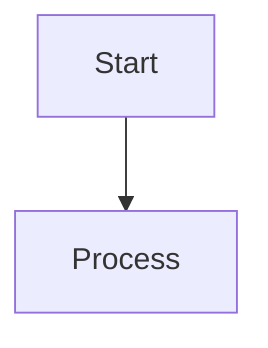

# Mermaid Validator

This directory contains utilities for validating and correcting Mermaid diagram syntax.

## Components

1. **validate_mermaid.js** - Node.js script that validates Mermaid syntax
2. **mermaid_validator.py** - Python wrapper that uses the Node.js validator and OpenAI for corrections
3. **package.json** - Node.js package configuration

## Setup

### Install Node.js Dependencies

```bash
cd backend/utils
npm install
```

This installs no dependencies currently (the validator is self-contained), but the package.json is configured for future needs.

### Environment Variables

Add these to your `.env` file:

```bash
# OpenAI Configuration (for Mermaid syntax correction)
OPENAI_API_KEY=your-openai-api-key-here
OPENAI_MODEL=gpt-4o
```

## Usage

### From Python

```python
from backend.utils.mermaid_validator import validate_mermaid_in_markdown

markdown_text = """

"""

# Validate and auto-correct
corrected_text, results = validate_mermaid_in_markdown(markdown_text, auto_correct=True)

for result in results:
    print(f"Valid: {result['is_valid']}")
    if result['correction_applied']:
        print(f"Corrected code:\n{result['corrected_code']}")
```

### From Command Line (Node.js validator only)

```bash
echo "graph TD\nA-->B" | node validate_mermaid.js
# Output: OK (exit code 0)

echo "graph TD\nA<br/>-->B" | node validate_mermaid.js
# Output: HTML tags not allowed in Mermaid: <br/> (exit code 1)
```

## How It Works

1. **Node.js Validator** (`validate_mermaid.js`):
   - Reads Mermaid diagram code from stdin
   - Performs basic syntax validation:
     - Checks for valid diagram type (graph, flowchart, sequenceDiagram, etc.)
     - Detects HTML tags (not allowed in Mermaid)
     - Identifies unquoted special characters in labels
   - Returns exit code 0 if valid, 1 if invalid with error message on stderr

2. **Python Validator** (`mermaid_validator.py`):
   - Extracts Mermaid code blocks from markdown using regex
   - Calls Node.js validator via subprocess for each diagram
   - If validation fails and `auto_correct=True`:
     - Sends the diagram and error message to OpenAI
     - Receives corrected Mermaid code
     - Validates the corrected code
     - Replaces the original diagram if correction is valid
   - Returns corrected markdown and validation results

## Common Syntax Errors Fixed

1. **HTML Tags**: `<br/>`, `<b>`, `<i>` → Removed or converted to plain text
2. **Special Characters**: `Contract (A ↔ B)` → `Contract ["A ↔ B"]` (quoted)
3. **Invalid Node IDs**: Characters other than alphanumeric, underscore, hyphen
4. **Arrow Syntax**: Incorrect connection syntax

## Integration

The validator is integrated into the router agent (`backend/agents/router_agent.py`) to automatically validate and correct Mermaid diagrams before returning responses to the frontend.

```python
# In router_agent.py _generate_unified_response
from backend.utils.mermaid_validator import validate_mermaid_in_markdown

response = postgres_result.get("response", "No response")
corrected_response, _ = validate_mermaid_in_markdown(response, auto_correct=True)
return corrected_response
```

## Testing

Run the test harness:

```bash
cd backend/utils
python mermaid_validator.py
```

This will test validation and correction on a sample markdown with problematic Mermaid syntax.

## Requirements

- **Node.js**: 18.0.0 or higher
- **Python**: 3.12+
- **OpenAI API Key**: Required for auto-correction feature

## Docker

The Dockerfile includes Node.js and npm for Mermaid validation in the container environment.
