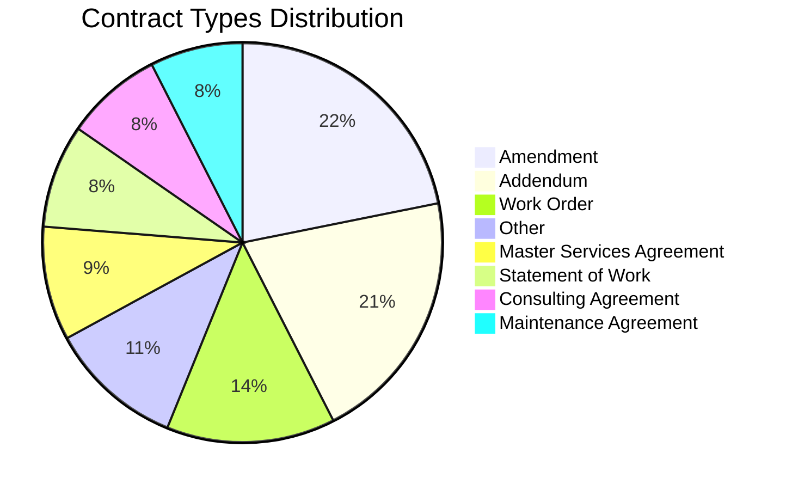
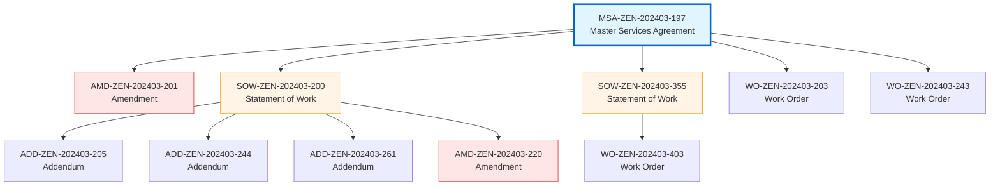
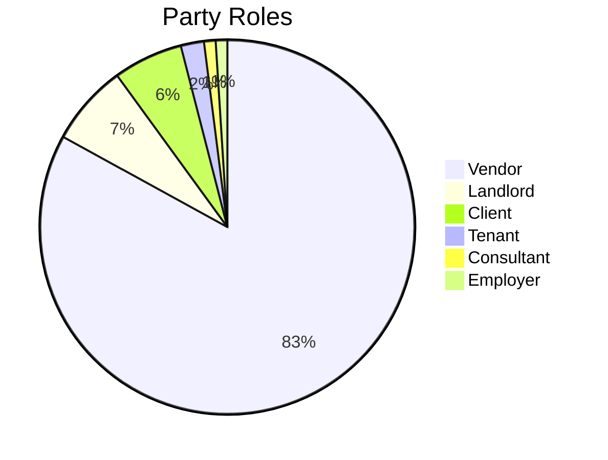
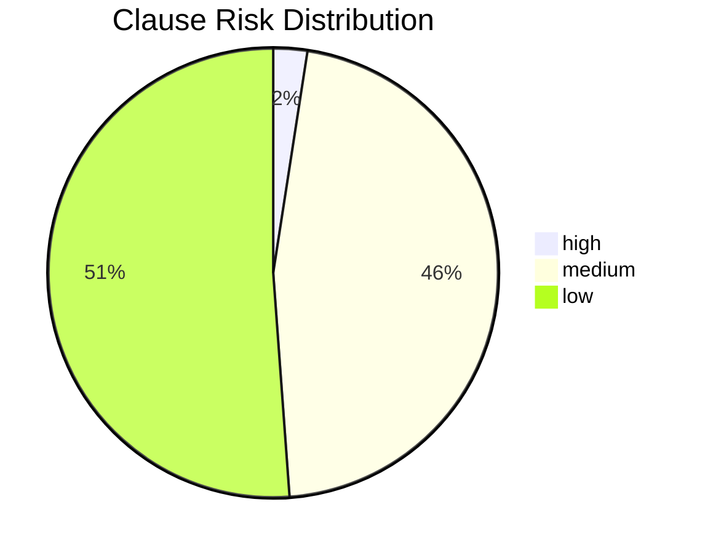

# Contract Intelligence Database Analysis Report

**Generated:** 2025-12-10 13:53:30

**Database:** cipgraph

---

## 📊 Executive Summary

- **Total Contracts:** 732
- **Total Parties:** 89
- **Total Clauses:** 7125
- **Total Risks Identified:** 3480
- **Total Obligations:** 27633
- **Total Rights:** 22805
- **Total Monetary Values:** 5986

---

## 📄 Contracts Analysis

### Contract Types (Total: 732)

| Contract Type | Count |
|---------------|-------|
| Amendment | 128 |
| Addendum | 121 |
| Work Order | 80 |
| Other | 64 |
| Master Services Agreement | 54 |
| Statement of Work | 49 |
| Consulting Agreement | 46 |
| Maintenance Agreement | 44 |
| Data Processing Agreement | 31 |
| Service Level Agreement | 31 |
| License Agreement | 29 |
| Purchase Order | 29 |
| Non-Disclosure Agreement | 26 |

### Contract Status

| Status | Count |
|--------|-------|
| active | 732 |

### Top Governing Laws

| Jurisdiction | Contract Count |
|--------------|----------------|
| England and Wales | 61 |
| Delaware | 53 |
| California | 48 |
| Singapore | 40 |
| Washington | 34 |
| Texas | 30 |
| New York | 18 |
| United Kingdom | 9 |
| UK | 1 |

### 🔗 Contract Relationships

| Relationship Type | Count |
|-------------------|-------|
| amendment | 102 |
| addendum | 98 |
| work_order | 42 |
| sow | 24 |
| maintenance | 18 |

⚠️ **Orphaned Relationships:** 6 (parent contracts not yet ingested)

### 🌳 Major Contract Families

| Master Agreement | Title | Type | Children |
|------------------|-------|------|----------|
| MSA-ZEN-202403-197 | Master Services Agreement between Contoso Enterpri... | Master Services Agreement | 5 |
| DPA-SUM-202502-324 | Data Processing and Services Agreement... | Data Processing Agreement | 4 |
| DPA-EPS-202404-459 | Data Processing Agreement... | Data Processing Agreement | 4 |
| PUR-PHO-202402-266 | Purchase Agreement between Contoso Enterprises and... | Purchase Order | 4 |
| SOW-ZEN-202403-200 | Statement of Work between Contoso Enterprises and ... | Statement of Work | 4 |
| DPA-PIN-202411-069 | Data Processing Agreement... | Data Processing Agreement | 4 |
| SLA-ZEN-202502-413 | Software License, Services, and Support Agreement... | License Agreement | 4 |
| CSA-EPS-202412-519 | Consulting Services Agreement... | Consulting Agreement | 3 |
| CSA-EPS-202407-536 | Consulting Services Agreement... | Consulting Agreement | 3 |
| LSE-MER-202510-574 | Master Lease and Services Agreement... | Master Services Agreement | 3 |

#### Sample Contract Hierarchy

---

## 👥 Parties Analysis

### Top Parties by Contract Count

| Party Name | Contracts |
|------------|-----------|
| Contoso Enterprises | 518 |
| Contoso Enterprises, Inc. | 181 |
| Acme Corp | 56 |
| Phoenix Industries | 42 |
| Cascade Enterprises | 40 |
| Atlas Ventures | 34 |
| Delta LLC | 33 |
| Epsilon Group | 32 |
| Nexus Corporation | 31 |
| Gamma Inc | 29 |

### Party Roles Distribution

| Role | Unique Parties |
|------|----------------|
| Vendor | 83 |
| Landlord | 7 |
| Client | 6 |
| Tenant | 2 |
| Consultant | 1 |
| Employer | 1 |

### Party Types

| Party Type | Count |
|------------|-------|
| Corporation | 89 |

---

## 📋 Clauses Analysis

**Total Clauses:** 7125

**Average Clauses per Contract:** 9.8

### Clause Types Distribution

| Clause Type | Count |
|-------------|-------|
| Definitions | 2587 |
| Other | 1477 |
| Payment Terms | 1059 |
| Termination | 896 |
| Confidentiality | 528 |
| Service Level Agreement | 370 |
| Intellectual Property | 112 |
| Acceptance Criteria | 35 |
| Change Management | 34 |
| Data Protection | 11 |
| Warranties | 6 |
| Indemnification | 2 |
| Dispute Resolution | 2 |
| Insurance | 2 |
| Limitation of Liability | 2 |
| Force Majeure | 2 |

### Risk Levels

| Risk Level | Clause Count |
|------------|--------------|
| ⚠️ High | 174 |
| ⚡ Medium | 3306 |
| ✓ Low | 3645 |

---

## ⚠️ Risks Analysis

**Total Risk Items:** 3480

**Contracts with High Risks:** 126

### Risk Severity Distribution

| Risk Level | Count |
|------------|-------|
| ⚠️ High | 174 |
| ⚡ Medium | 3306 |

---

## ⚖️ Obligations & Rights Analysis

**Total Obligations:** 27633

**High-Impact Obligations:** 22760

**Total Rights:** 22805

### Top Parties by Obligation Count

| Party | Obligations |
|-------|-------------|
| Quantum Labs | 121 |
| Contoso Enterprises | 106 |
| Summit Tech | 71 |
| Stellar Dynamics | 25 |
| Contoso Enterprises, Inc. | 18 |

---

## 💰 Monetary Values Analysis

**Total Monetary References:** 5986

### Currency Distribution

| Currency | Count | Total Amount |
|----------|-------|--------------|
| USD | 5977 | 6,212,319,580.67 |
| GBP | 9 | 682.00 |

### Value Types

| Value Type | Count |
|------------|-------|
| Total Contract Value | 512 |
| total contract value | 113 |
| time_period_days | 106 |
| percentage | 99 |
| Contract Value | 61 |
| milestone payment | 58 |
| percentage_threshold | 55 |
| Hourly rate | 45 |
| contract_value | 41 |
| Milestone Payment | 41 |

---

## 📈 Data Quality Notes

- All data extracted using LLM-based contract analysis
- Embeddings generated for semantic search capabilities
- Full-text search vectors created for keyword matching
- Graph relationships established for multi-hop reasoning

*Report generated automatically on 2025-12-10 at 13:53:30*