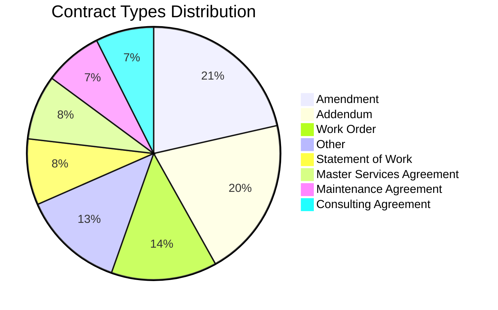
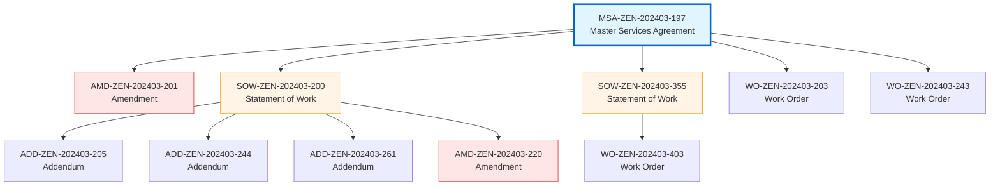
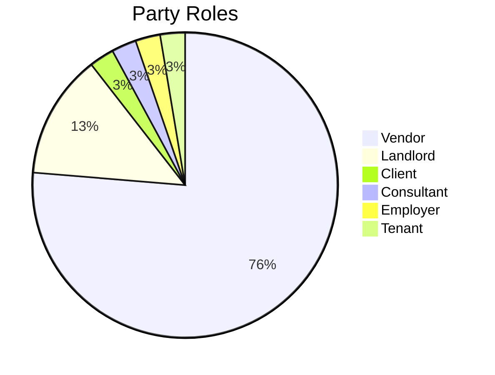
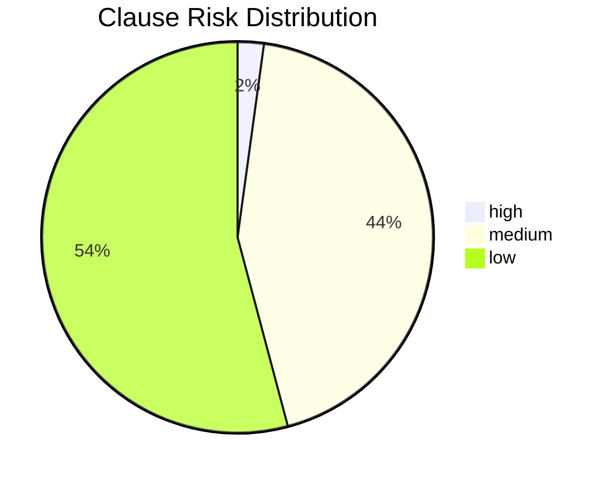

# Contract Intelligence Database Analysis Report

**Generated:** 2025-12-17 12:47:32

**Database:** cipgraph

---

## 📊 Executive Summary

- **Total Contracts:** 731
- **Total Parties:** 30
- **Total Clauses:** 6330
- **Total Risks Identified:** 2903
- **Total Obligations:** 24754
- **Total Rights:** 20546
- **Total Monetary Values:** 5587

---

## 📄 Contracts Analysis

### Contract Types (Total: 731)

| Contract Type | Count |
|---------------|-------|
| Amendment | 127 |
| Addendum | 121 |
| Work Order | 80 |
| Other | 77 |
| Statement of Work | 50 |
| Master Services Agreement | 49 |
| Maintenance Agreement | 44 |
| Consulting Agreement | 44 |
| Data Processing Agreement | 31 |
| Service Level Agreement | 31 |
| License Agreement | 28 |
| Non-Disclosure Agreement | 25 |
| Purchase Order | 24 |

### Contract Status

| Status | Count |
|--------|-------|
| active | 731 |

### Top Governing Laws

| Jurisdiction | Contract Count |
|--------------|----------------|
| England and Wales | 65 |
| California | 52 |
| Delaware | 50 |
| Singapore | 37 |
| Washington | 32 |
| Texas | 27 |
| New York | 20 |
| United Kingdom | 6 |
| UK | 1 |

### 🔗 Contract Relationships

| Relationship Type | Count |
|-------------------|-------|
| amendment | 105 |
| addendum | 94 |
| work_order | 41 |
| sow | 26 |
| maintenance | 18 |

⚠️ **Orphaned Relationships:** 6 (parent contracts not yet ingested)

### 🌳 Major Contract Families

| Master Agreement | Title | Type | Children |
|------------------|-------|------|----------|
| MSA-ZEN-202403-197 | Master Services Agreement between Contoso Enterpri... | Master Services Agreement | 5 |
| DPA-SUM-202502-324 | Data Processing and Services Agreement... | Data Processing Agreement | 4 |
| DPA-EPS-202404-459 | Data Processing Agreement... | Data Processing Agreement | 4 |
| PUR-PHO-202402-266 | Purchase Agreement between Contoso Enterprises and... | Purchase Order | 4 |
| SOW-ZEN-202403-200 | Statement of Work - SOW-ZEN-202403-200... | Statement of Work | 4 |
| DPA-PIN-202411-069 | Data Processing Agreement... | Data Processing Agreement | 4 |
| SLA-ZEN-202502-413 | Software License, Services, and Support Agreement... | License Agreement | 4 |
| CSA-EPS-202412-519 | Consulting Services Agreement... | Consulting Agreement | 3 |
| CSA-EPS-202407-536 | Consulting Services Agreement... | Consulting Agreement | 3 |
| LSE-MER-202510-574 | Master Lease and Services Agreement... | Master Services Agreement | 3 |

#### Sample Contract Hierarchy

---

## 👥 Parties Analysis

### Top Parties by Contract Count

| Party Name | Contracts |
|------------|-----------|
| Contoso Enterprises | 731 |
| Phoenix Industries | 57 |
| Acme Corp | 56 |
| Zenith Technologies | 53 |
| Atlas Ventures | 46 |
| Cascade Enterprises | 44 |
| Epsilon Group | 44 |
| Pinnacle Services | 41 |
| Meridian Solutions, Inc. | 35 |
| Horizon Partners | 35 |

### Party Roles Distribution

| Role | Unique Parties |
|------|----------------|
| Vendor | 29 |
| Landlord | 5 |
| Client | 1 |
| Consultant | 1 |
| Employer | 1 |
| Tenant | 1 |

### Party Types

| Party Type | Count |
|------------|-------|
| Corporation | 30 |

---

## 📋 Clauses Analysis

**Total Clauses:** 6330

**Average Clauses per Contract:** 8.8

### Clause Types Distribution

| Clause Type | Count |
|-------------|-------|
| Definitions | 2477 |
| Other | 1035 |
| Payment Terms | 929 |
| Termination | 804 |
| Confidentiality | 484 |
| Service Level Agreement | 435 |
| Intellectual Property | 99 |
| Change Management | 27 |
| Acceptance Criteria | 23 |
| Data Protection | 13 |
| Warranties | 3 |
| Dispute Resolution | 1 |

### Risk Levels

| Risk Level | Clause Count |
|------------|--------------|
| ⚠️ High | 137 |
| ⚡ Medium | 2766 |
| ✓ Low | 3427 |

---

## ⚠️ Risks Analysis

**Total Risk Items:** 2903

**Contracts with High Risks:** 113

### Risk Severity Distribution

| Risk Level | Count |
|------------|-------|
| ⚠️ High | 137 |
| ⚡ Medium | 2766 |

---

## ⚖️ Obligations & Rights Analysis

**Total Obligations:** 24754

**High-Impact Obligations:** 20494

**Total Rights:** 20546

### Top Parties by Obligation Count

| Party | Obligations |
|-------|-------------|
| Contoso Enterprises | 169 |
| Quantum Labs LLC | 119 |
| Summit Tech | 71 |
| Stellar Dynamics, LLC | 38 |
| Phoenix Industries | 14 |

---

## 💰 Monetary Values Analysis

**Total Monetary References:** 5587

### Currency Distribution

| Currency | Count | Total Amount |
|----------|-------|--------------|
| USD | 5576 | 6,040,960,338.21 |
| GBP | 11 | 8,661.00 |

### Value Types

| Value Type | Count |
|------------|-------|
| Total Contract Value | 514 |
| total contract value | 79 |
| percentage_threshold | 69 |
| Contract Value | 61 |
| percentage | 55 |
| Hourly rate | 55 |
| time_period_days | 53 |
| milestone payment | 53 |
| Total contract value | 46 |
| Milestone Payment | 45 |

---

## 📈 Data Quality Notes

- All data extracted using LLM-based contract analysis
- Embeddings generated for semantic search capabilities
- Full-text search vectors created for keyword matching
- Graph relationships established for multi-hop reasoning

*Report generated automatically on 2025-12-17 at 12:47:32*